<div align="center">

# 🚜 Autonomous Potato Disease Detection Rover

### Edge-Based Precision Agriculture Platform for Real-Time Disease Detection, Severity Estimation and Intelligent Crop Management

<p>


</p>

**🚀 Lightweight Edge AI • 📷 Computer Vision • 🌱 Precision Agriculture • 🤖 Intelligent Decision Support**

</div>

---

## 📖 Overview

This project presents an **edge-based autonomous agricultural rover** capable of detecting potato leaf diseases in real time using **MobileNetV3** optimized with **TensorFlow Lite** for deployment on **Raspberry Pi 5**.

Unlike conventional disease classification systems, the proposed platform provides a complete agricultural decision support framework by integrating:

- 🌿 Real-time disease detection
- 📊 Disease severity estimation
- 🤖 AI-generated treatment recommendation
- 💊 Vendor inventory support
- 🗺 Interactive disease heatmap
- 💾 FastAPI backend with SQLite
- 📩 Telegram notifications
- 📈 Dashboard analytics

The complete system operates entirely on edge hardware while maintaining high prediction accuracy and low inference latency, making it suitable for practical precision agriculture.

---

# ✨ Key Features

| Feature | Description |
|----------|-------------|
| 🌿 Disease Detection | Healthy, Early Blight and Late Blight classification |
| 📊 Severity Estimation | Quantifies infected leaf area |
| ⚡ TensorFlow Lite | Optimized for Raspberry Pi deployment |
| 🤖 AI Recommendation | Generates treatment suggestions |
| 📩 Telegram Alerts | Sends instant disease notifications |
| 🗺 Disease Heatmap | Visual crop health monitoring |
| 💾 FastAPI Backend | REST API with SQLite database |
| 📈 Dashboard | Detection history and analytics |

---

# 🛠 Technology Stack

| Category | Technologies |
|-----------|--------------|
| Programming | Python |
| AI Framework | TensorFlow, TensorFlow Lite |
| Model | MobileNetV3 |
| Backend | FastAPI |
| Database | SQLite |
| Frontend | HTML, CSS, JavaScript |
| Edge Device | Raspberry Pi 5 |
| Notification | Telegram Bot API |
| AI Assistant | OpenRouter API |

---

# 📑 Table of Contents

- 📸 Hardware Prototype
- 🏗 System Architecture
- 🔄 Workflow
- 🧠 Deep Learning Model
- 📊 Experimental Results
- 🍃 Disease Detection Examples
- 🗺 Disease Heatmap
- 💻 Dashboard
- ⚙ Backend Architecture
- 🚀 Installation
- 📁 Repository Structure
- 🔮 Future Scope
- 📜 License


# 📸 Hardware Prototype

The developed rover integrates Raspberry Pi 5, an onboard camera module, edge AI inference, backend communication and precision agriculture support into a compact autonomous platform.

<p align="center">

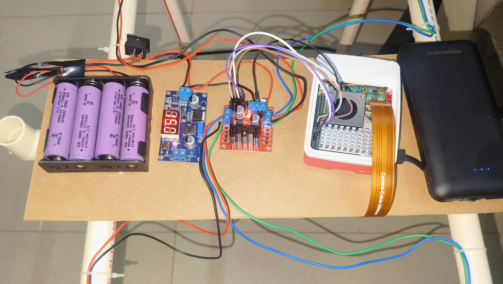

</p>

### Additional Hardware Views

| Front View | Side View |
|:----------:|:---------:|
| 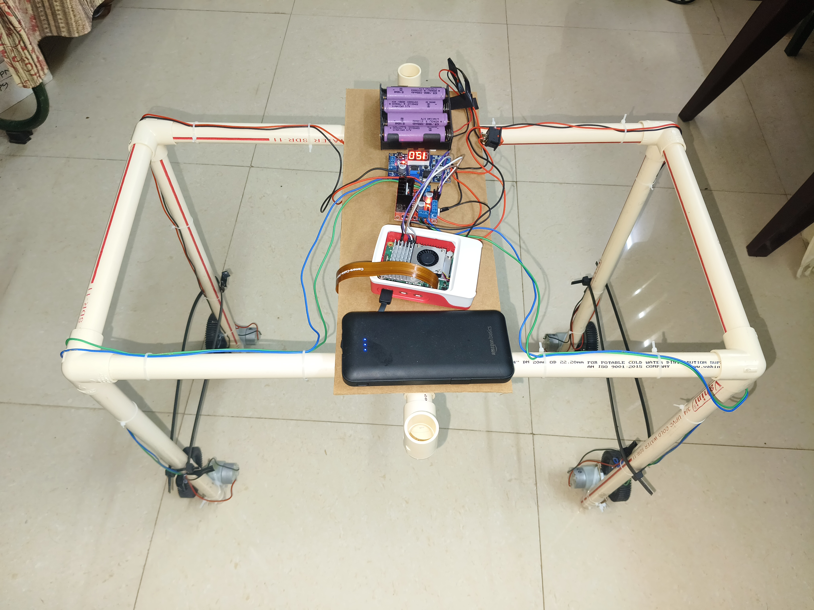 | 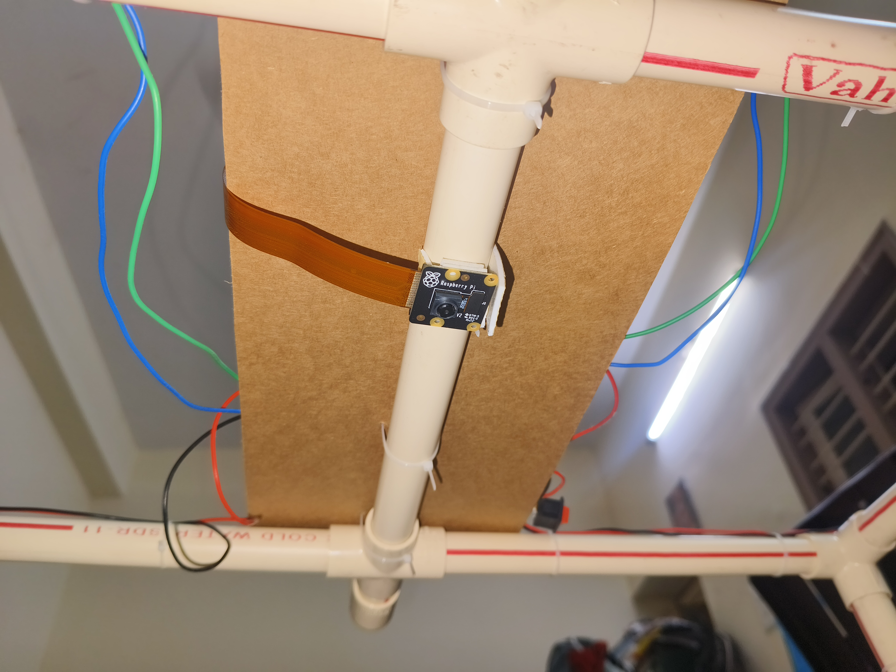 |

---

# 🏗 Proposed System Architecture

<p align="center">

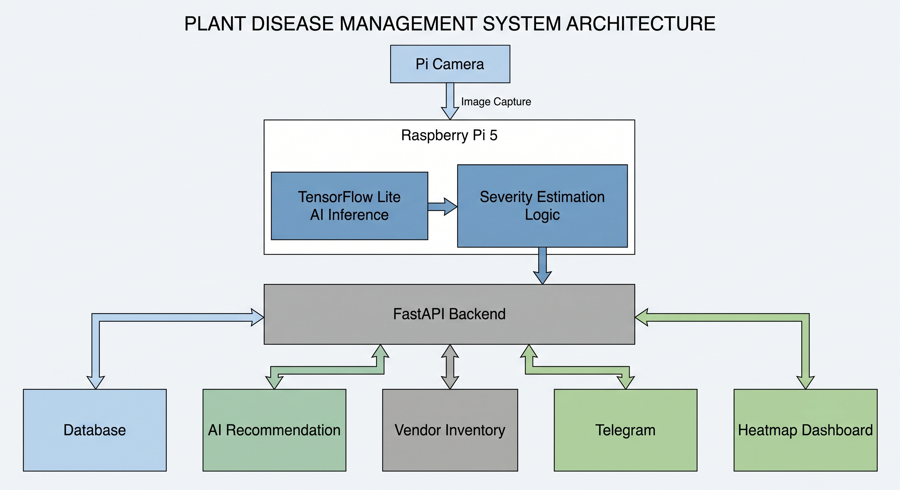

</p>

The proposed architecture integrates edge computing, lightweight deep learning, disease severity estimation, backend analytics, AI-assisted treatment recommendation, and visualization into a unified precision agriculture platform.

---

# 🔄 Complete System Workflow

<p align="center">

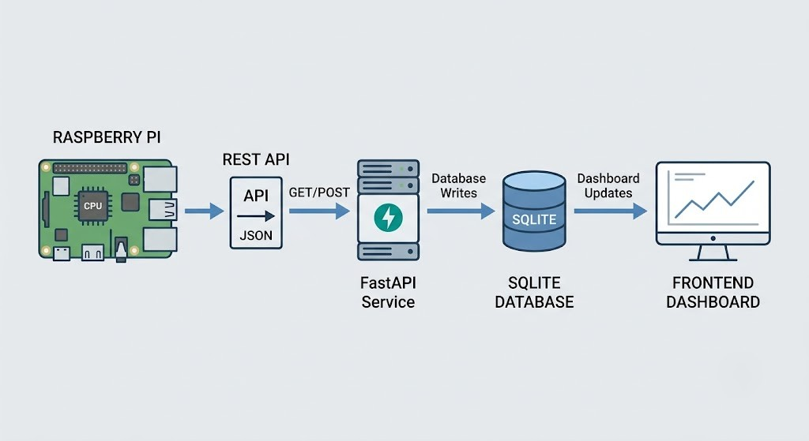

</p>

The workflow begins with image acquisition on Raspberry Pi, followed by disease classification using MobileNetV3, severity estimation, backend storage, recommendation generation, and dashboard visualization.

---

# 🧠 Deep Learning Model

| Parameter | Value |
|------------|-------|
| Model | MobileNetV3 |
| Framework | TensorFlow |
| Deployment | TensorFlow Lite |
| Transfer Learning | ImageNet |
| Classes | Healthy, Early Blight, Late Blight |
| Edge Device | Raspberry Pi 5 |
| Average Inference Time | **10.99 ms** |
| Overall Accuracy | **97.63%** |

---

# 📊 Model Performance

## Training Accuracy

<p align="center">

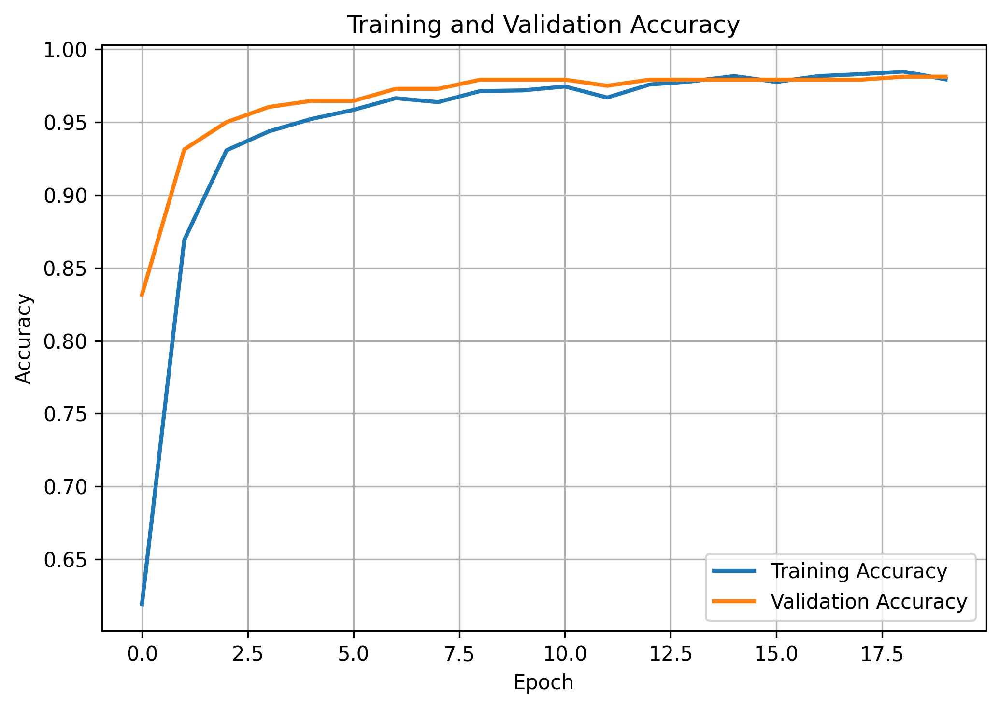

</p>

The MobileNetV3 model demonstrates smooth convergence with both training and validation accuracy exceeding **97%**, indicating excellent generalization.

---

## Training Loss

<p align="center">

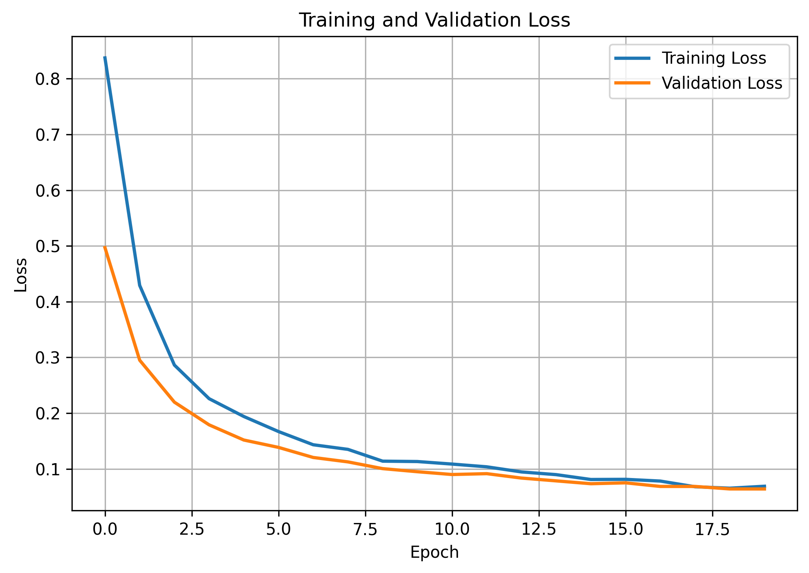

</p>

Both training and validation loss decrease consistently, demonstrating stable optimization with minimal overfitting.

---

## Confusion Matrix

<p align="center">


</p>

The classifier accurately distinguishes among Healthy, Early Blight, and Late Blight classes with very few misclassifications.

---

## Precision–Recall Curve

<p align="center">

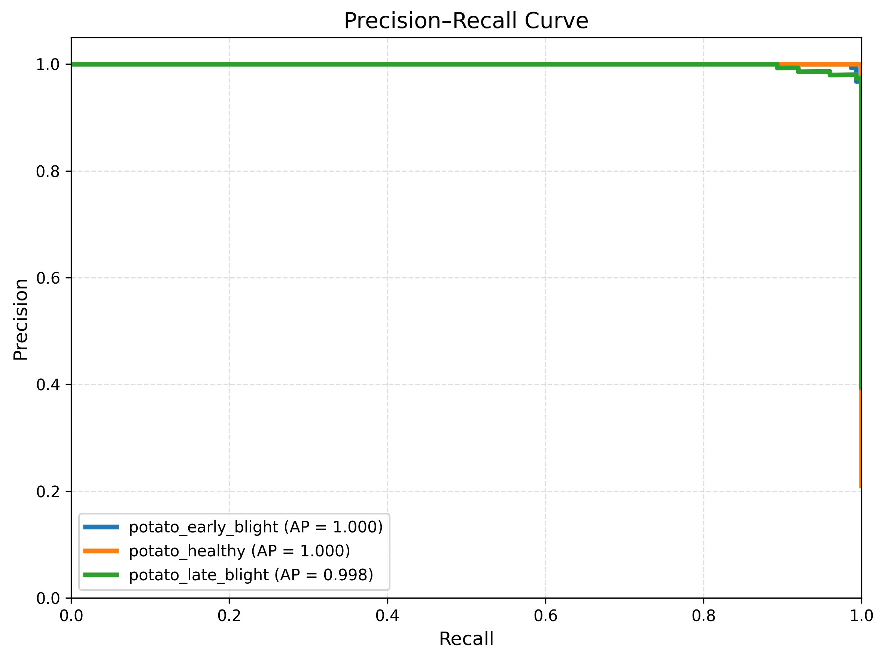

</p>

The Precision–Recall curves remain close to the upper-right corner, confirming excellent confidence and balanced performance across all disease classes.

---

# 📈 Experimental Results

| Metric | Result |
|---------|--------|
| Classification Accuracy | **97.63%** |
| Weighted F1 Score | **97.65%** |
| Average Inference Time | **10.99 ms** |
| Deployment Platform | Raspberry Pi 5 |
| Disease Classes | 3 |
| Edge Deployment | TensorFlow Lite |

---

# 🍃 Disease Detection Examples

The proposed framework classifies potato leaves into three categories: **Healthy**, **Early Blight**, and **Late Blight**. Each prediction includes the disease class, confidence score, and severity estimation, enabling accurate field-level disease monitoring.

---

## 🌿 Healthy Leaf Detection

| Input Leaf | Prediction |
|:----------:|:----------:|
|  | 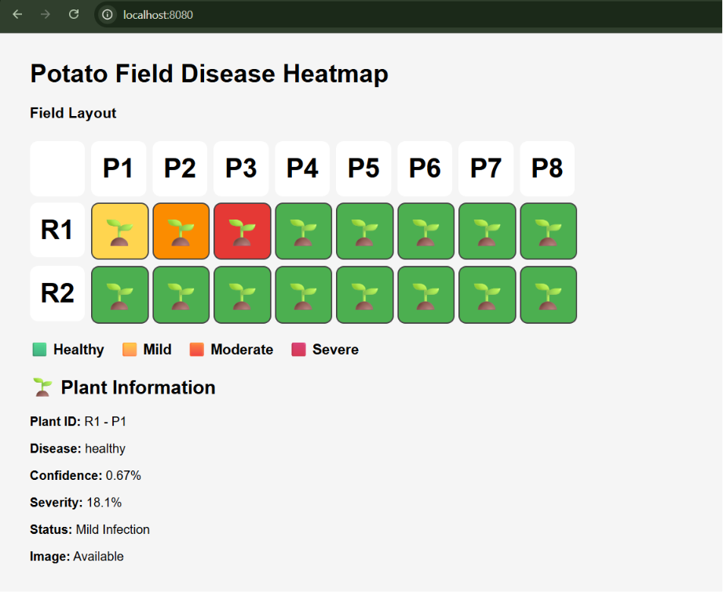 |

**Result:** The model correctly identifies the leaf as **Healthy**, indicating no visible infection and therefore no treatment is required.

---

## 🍂 Early Blight Detection

| Input Leaf | Prediction |
|:----------:|:----------:|
|  | 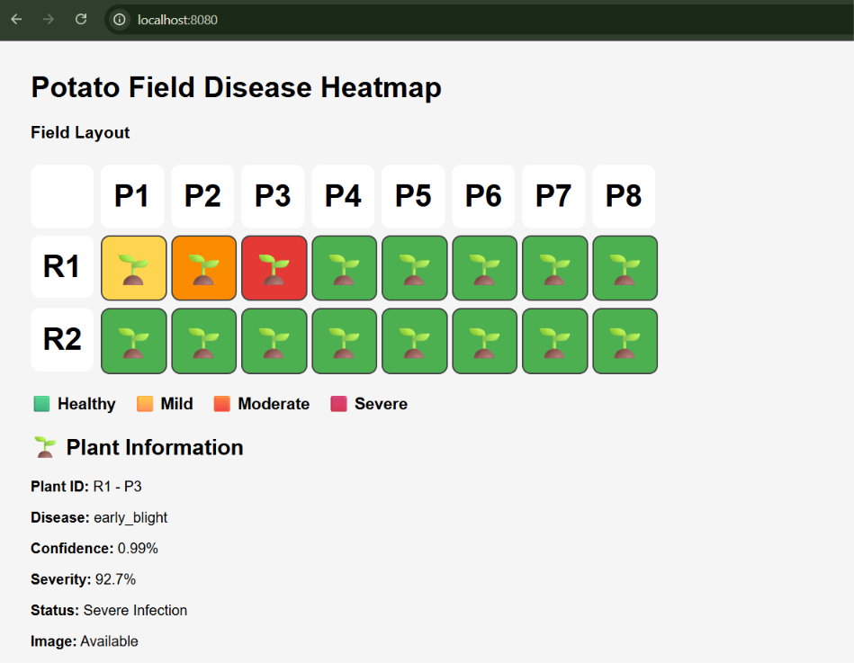 |

**Result:** The system successfully detects **Early Blight**, estimates the infected area, and forwards the detection to the backend for recommendation generation.

---

## 🍁 Late Blight Detection

| Input Leaf | Prediction |
|:----------:|:----------:|
|  | 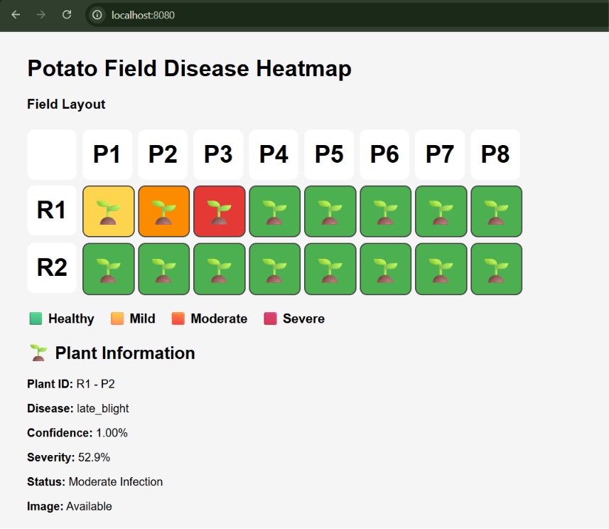 |

**Result:** The framework accurately classifies **Late Blight**, estimates disease severity, stores the detection, and initiates recommendation and notification services.

---

# 🗺 Disease Heatmap

The backend continuously generates a disease heatmap that visualizes disease distribution across the monitored field. Each grid cell represents a plant location, while the color intensity corresponds to the estimated disease severity.

| Heatmap View | Dashboard Heatmap |
|:------------:|:----------------:|
| 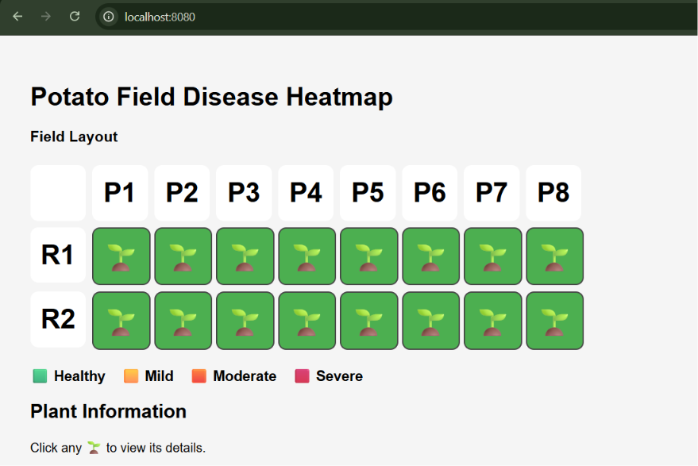 | 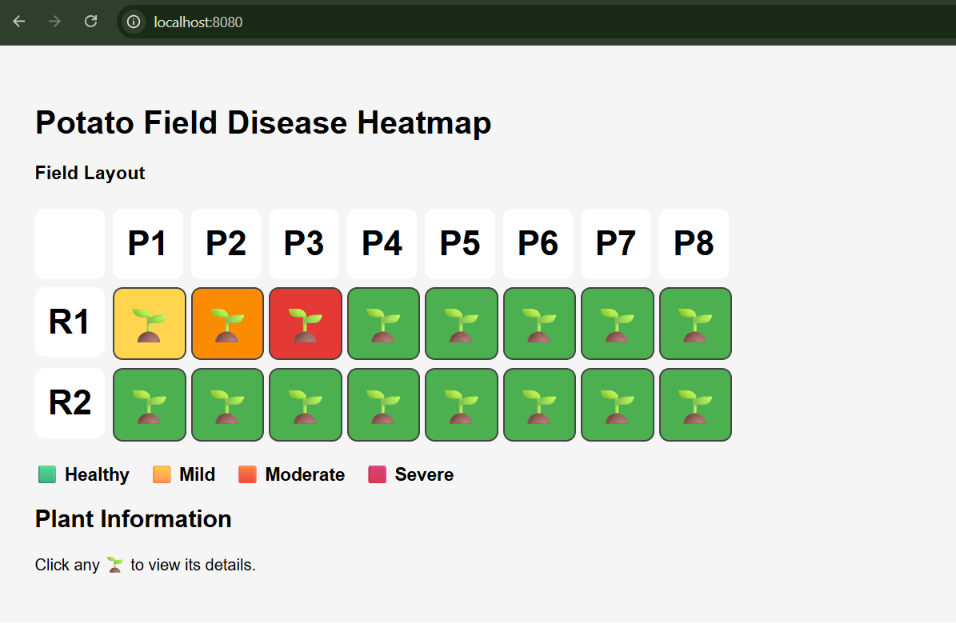 |

**Benefits**

- 🌱 Early hotspot identification
- 💊 Localized pesticide application
- 📉 Reduced chemical usage
- 📊 Improved crop health monitoring

---

# 💻 Interactive Dashboard

The FastAPI backend provides an interactive dashboard for monitoring disease detections and backend analytics.

| Detection Dashboard | Analytics Dashboard |
|:-------------------:|:------------------:|
| 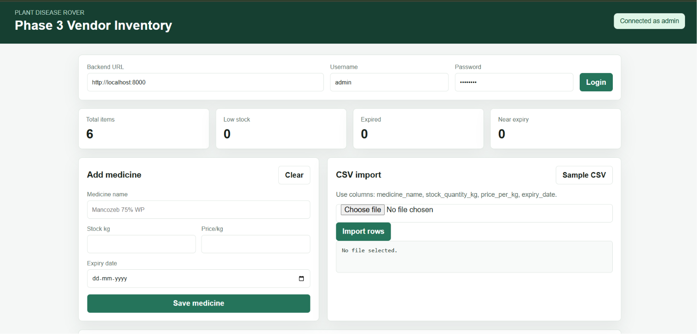 | 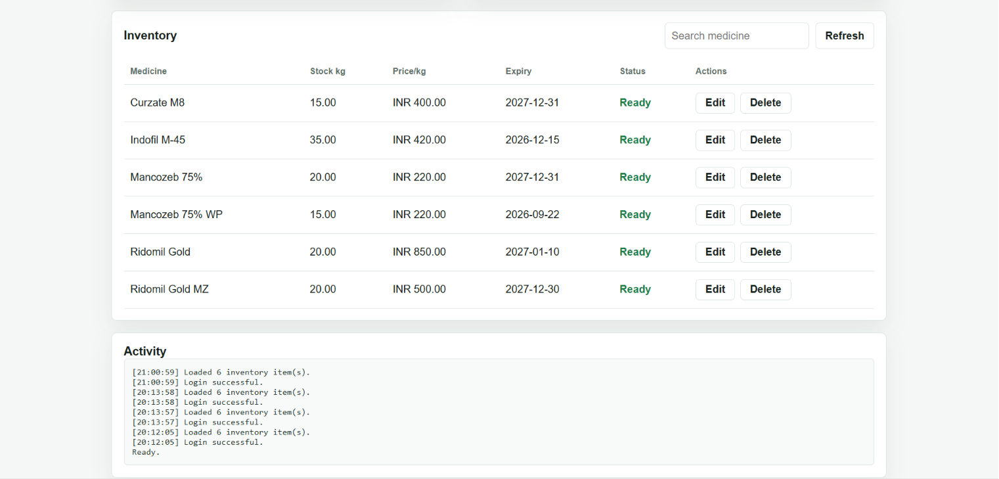 |

The dashboard enables farmers and researchers to monitor:

- Detection history
- Disease statistics
- Severity distribution
- Heatmap visualization
- Backend status
- Historical records

---

# 📑 Project Pipeline

The following diagrams summarize the overall processing pipeline implemented in the proposed framework.

| Pipeline | Backend | Deployment |
|:--------:|:-------:|:----------:|
| 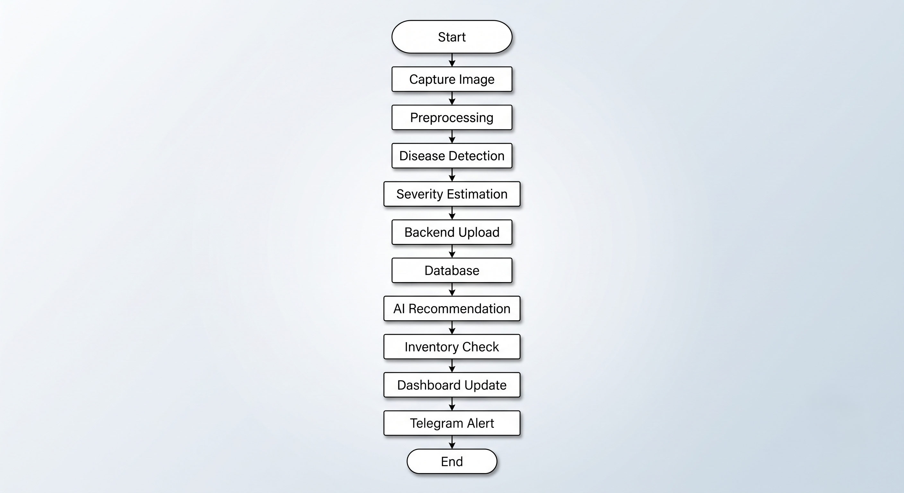 | 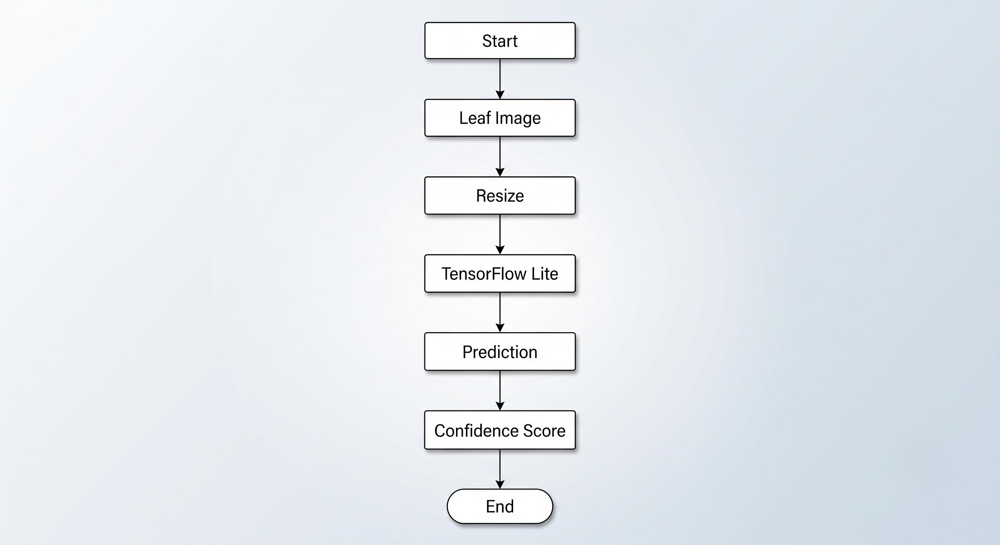 | 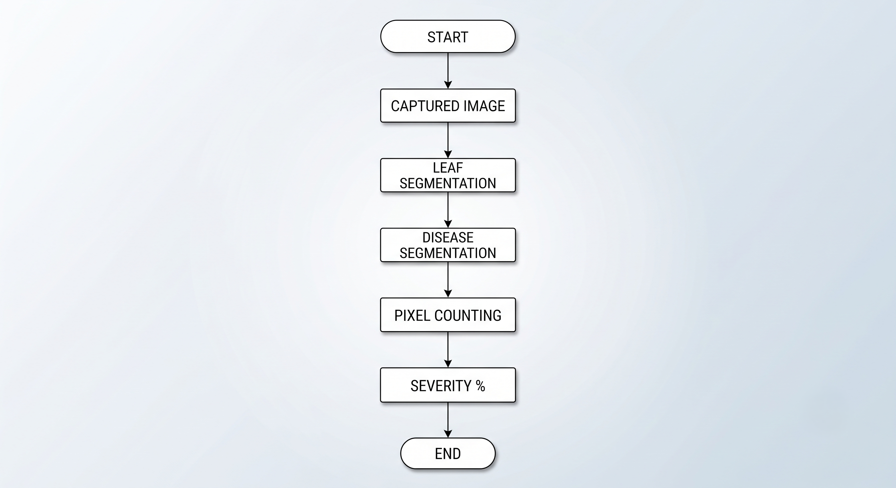 |

---

# 🤖 Intelligent Decision Support

Unlike conventional plant disease classifiers, the proposed framework extends beyond prediction by providing intelligent agricultural assistance.

### After every detection, the system automatically generates:

- 📖 Disease Description
- ⚠️ Probable Causes
- 🌿 Preventive Measures
- 💊 Fungicide Recommendations
- 🌱 Organic Treatment Options
- 🚜 Crop Management Guidelines
- 🛒 Vendor Inventory Suggestions

This enables farmers to receive actionable recommendations immediately after disease detection, reducing response time and improving crop management decisions.

---

# 📩 Telegram Notification System

Once a disease is detected, the backend automatically sends a Telegram notification containing:

- 🌿 Disease Name
- 📊 Confidence Score
- 📈 Disease Severity
- 💊 Treatment Recommendation
- 🕒 Detection Timestamp

This allows users to receive real-time alerts without continuously monitoring the dashboard.

---

# ⚙️ Backend Architecture

The backend is developed using **FastAPI**, providing a lightweight and high-performance REST API framework for seamless communication between the edge device, dashboard, database, and AI recommendation engine.

## Backend Modules

| Module | Function |
|---------|----------|
| Detection API | Stores disease detection records |
| Dashboard API | Provides analytics and statistics |
| Recommendation Engine | Generates intelligent treatment suggestions |
| Inventory API | Displays relevant agricultural products |
| Heatmap API | Updates disease visualization |
| Notification Service | Sends Telegram alerts |
| SQLite Database | Stores historical records |

---

# 🗄 Database

The proposed framework uses **SQLite** for lightweight and efficient local storage.

Each detection record includes:

- Disease Name
- Confidence Score
- Disease Severity
- Timestamp
- Plant Location
- Image Path
- Recommendation Status
- Notification Status

This enables efficient retrieval of historical disease information for visualization and analysis.

---

# 📂 Repository Structure

```text
Autonomous-Potato-Disease-Detection-Rover
│
├── backend/
├── docs/
├── heatmap_dashboard/
├── images/
├── phase3/
├── phase4/
├── phase6/
├── phase7/
├── README.md
└── .gitignore
```

---

# 🚀 Installation

## Clone Repository

```bash
git clone https://github.com/rohanasgowda/Autonomous-Potato-Disease-Detection-Rover.git

cd Autonomous-Potato-Disease-Detection-Rover
```

---

## Install Requirements

Backend

```bash
cd backend
pip install -r requirements.txt
```

Phase 3

```bash
cd ../phase3
pip install -r requirements.txt
```

Phase 4

```bash
cd ../phase4
pip install -r requirements.txt
```

---

## Configure Environment Variables

Create a `.env` file:

```env
OPENROUTER_API_KEY=YOUR_API_KEY
TELEGRAM_BOT_TOKEN=YOUR_TOKEN
TELEGRAM_CHAT_ID=YOUR_CHAT_ID
```

---

## Start Backend

```bash
cd backend
uvicorn app.main:app --reload
```

---

## Run Dashboard

```bash
cd heatmap_dashboard
python -m http.server
```

Then open:

```
http://localhost:8000
```

---

# 📈 Experimental Performance

| Metric | Result |
|---------|--------|
| Overall Accuracy | **97.63%** |
| Weighted F1 Score | **97.65%** |
| Average Inference Time | **10.99 ms** |
| Deployment Platform | Raspberry Pi 5 |
| Deep Learning Model | MobileNetV3 |
| Optimization | TensorFlow Lite |

---

# 🌍 Applications

The proposed framework can be used in:

- 🌾 Precision Agriculture
- 🚜 Smart Farming
- 🌱 Crop Disease Monitoring
- 📊 Agricultural Research
- 🤖 AI-assisted Farming
- 🌍 Edge AI Applications
- 🛰 IoT-based Agriculture
- 🌿 Sustainable Crop Management

---

# 🔬 Research Contributions

The proposed work integrates multiple technologies into a single end-to-end precision agriculture platform.

### Major Contributions

- Lightweight MobileNetV3 classifier
- TensorFlow Lite edge deployment
- Disease severity estimation
- FastAPI backend
- Interactive dashboard
- Heatmap visualization
- Telegram notification system
- AI-assisted treatment recommendation
- Vendor inventory integration

Unlike conventional plant disease classifiers, the proposed system provides complete decision support from disease detection to treatment recommendation.

---

# 🔮 Future Scope

Future enhancements include:

- GPS-based autonomous navigation
- Multi-crop disease detection
- Cloud synchronization
- Weather-aware recommendations
- Drone-assisted crop monitoring
- Mobile application
- Real-time IoT sensor integration
- Large-scale farm analytics

---

# 👨‍💻 Author

**Rohan A S Gowda**

Department of Electronics and Communication Engineering

JSS Science and Technology University

Mysuru, Karnataka, India

---

# 🙏 Acknowledgements

Special thanks to:

- JSS Science and Technology University
- Open Source Community
- Raspberry Pi Foundation
- TensorFlow Team
- FastAPI Developers
- OpenRouter

---

# 📜 License

This repository is intended for **academic and research purposes**.

---

# ⭐ Support

If you found this project useful,

⭐ **Please consider starring this repository!**

It helps others discover the project and supports future development.

---

<div align="center">

## 🌱 Building Smarter Agriculture with Edge AI

**Made with ❤️ using Raspberry Pi 5, TensorFlow Lite, FastAPI and MobileNetV3**

</div>

