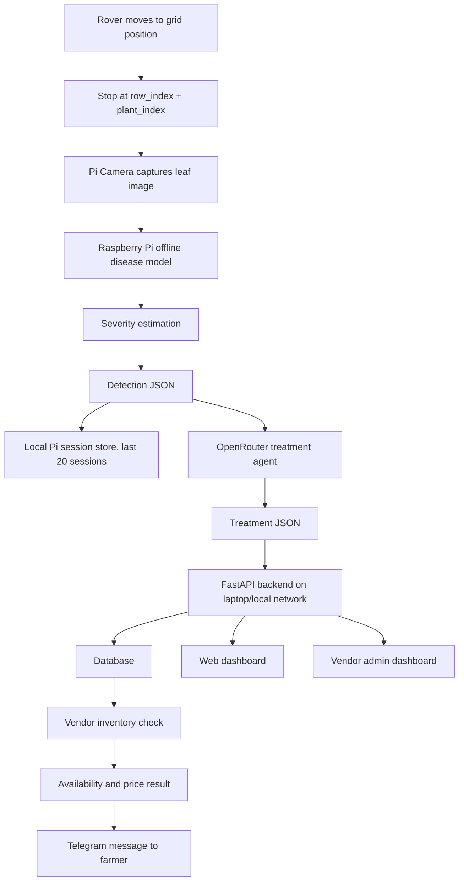

# Plant Disease Detection Rover - Requirements and Implementation Plan

Date: 2026-05-23  
Project type: College prototype  
Primary objective: Build a Raspberry Pi based rover system that captures plant leaf images, detects crop disease offline, estimates disease severity, recommends treatment through an OpenRouter based agent, checks vendor inventory through a local backend, and sends the final result to the farmer through Telegram.

## 1. Project Summary

The system is a wheeled rover designed for short row crops. It moves above the crop row using a grid based map, stops at each plant position, captures one downward-facing image, performs disease detection on the Raspberry Pi, and generates a structured JSON result.

The Raspberry Pi then sends the disease result to an LLM treatment agent through OpenRouter. The treatment agent returns a structured JSON recommendation containing treatment, quantity in kg/acre, safety instructions, and application frequency. This result is sent to a local FastAPI backend running on a laptop. The backend saves detection and recommendation records, checks a single vendor inventory database, and prepares availability and price information. The farmer receives the final output through Telegram.

The prototype does not include automatic spraying, GPS, soil sensors, weather sensors, multi-vendor comparison, order placement, or local language support.

## 2. Confirmed Scope

### Included in Prototype

- Wheeled rover with Raspberry Pi 4, Pi Camera, battery, motor driver, and PVC gantry frame.
- Downward-facing plant image capture.
- Grid based plant mapping using `row_index` and `plant_index`.
- One image captured each time the rover stops.
- Offline plant disease model inference on Raspberry Pi.
- Disease severity estimation.
- Last 20 detection sessions stored locally on the Raspberry Pi, configurable later.
- OpenRouter based cloud treatment agent called from the Raspberry Pi.
- Treatment recommendation as strict JSON.
- Local FastAPI backend running on laptop/local network.
- Web dashboard for system/admin view.
- Single vendor admin dashboard.
- Inventory check using medicine name, stock quantity, price, and expiry date.
- Telegram notification to farmer.
- English language output.
- Public datasets for initial model training.

### Excluded from Prototype

- Autonomous spraying.
- Cheapest vendor selection.
- Multiple vendors.
- Vendor accept/reject order flow.
- Payment flow.
- GPS based navigation.
- Local language support.
- Fully cloud hosted backend.
- Production-grade authentication.
- Official agronomist-certified treatment engine.

## 3. Functional Modules

The project should be divided into four functional parts:

1. Model and severity estimation module
2. Raspberry Pi rover edge system
3. Treatment agent and notification module
4. Backend, database, and vendor dashboard module

This split keeps the ML, hardware, LLM agent, and backend responsibilities clean.

## 4. System Architecture



## 5. Crop Selection

The crop set should prioritize short row crops that can be inspected from above by a gantry-style rover. This is more important than simply choosing the highest-volume crops in India, because crops like tomato can become tall and structurally unsuitable for this rover design.

Recommended first five crops:

| Crop | Reason for inclusion | Rover suitability | Dataset note |
|---|---|---:|---|
| Carrot | User-requested example, short crop, row-grown | High | Public datasets may be scattered; custom field images recommended |
| Beetroot | User-requested example, short crop, clear leaf canopy | High | Public beet/sugar beet leaf disease datasets can help |
| Cauliflower | User-requested example, important Indian vegetable, low canopy | High | Public brassica/cauliflower datasets may need augmentation |
| Cabbage | Short, row-grown, disease patterns similar to brassicas | High | Can share brassica disease learning with cauliflower |
| Potato | Very important Indian crop and short row crop | Medium to high | Strong public dataset support through PlantVillage-style datasets |

Rationale:

- Government of India horticulture estimates for 2023-24 list vegetables at about 205.80 million tonnes, with potato at about 570.49 lakh tonnes and production increases expected for cabbage, cauliflower, and carrot.
- Potato is included because it is highly relevant and has good public dataset support.
- Carrot, beetroot, cauliflower, and cabbage fit the rover's overhead image capture concept better than tall/staked crops.

## 6. Initial Disease Coverage

The goal is around five diseases or health classes per crop. In practice, each crop should include a `healthy` class, so the first version should target 4 major diseases plus healthy where dataset availability allows.

### Carrot

- Healthy
- Alternaria leaf blight
- Cercospora leaf blight
- Bacterial leaf blight
- Powdery mildew

Notes: Cornell Vegetable Program describes carrot leaf blights caused by Alternaria, Cercospora, and bacterial pathogens, with severity often assessed by percentage of leaf surface affected.

### Beetroot

- Healthy
- Cercospora leaf spot
- Powdery mildew
- Downy mildew
- Rust or bacterial leaf spot, depending on available dataset quality

Notes: Beetroot and sugar beet disease datasets can be useful, but labels must be checked carefully because sugar beet and table beet are related but not always identical in field appearance.

### Cauliflower

- Healthy
- Downy mildew
- Black rot
- Alternaria leaf spot
- Clubroot or white mold, depending on image availability

Notes: Some cauliflower diseases affect heads, stems, or roots more than leaves. Since the rover captures top leaf images, the model should focus on visible foliar symptoms first.

### Cabbage

- Healthy
- Black rot
- Downy mildew
- Alternaria leaf spot
- Bacterial leaf spot

Notes: Cabbage and cauliflower are both brassicas, so some disease categories and management logic can be shared, but the model should still classify the crop separately.

### Potato

- Healthy
- Early blight
- Late blight
- Leaf roll virus
- Bacterial spot or blackleg symptoms, depending on dataset availability

Notes: PlantVillage-style datasets commonly include potato early blight, late blight, and healthy classes. Potato is a good first training target because dataset availability is stronger than for carrot/beetroot/cauliflower.

## 7. ML Framework Recommendation

### Recommended Path

Use TensorFlow/Keras for training and TensorFlow Lite for Raspberry Pi inference.

Recommended baseline:

- Train on laptop using TensorFlow/Keras.
- Use transfer learning with MobileNetV3Small, EfficientNet-Lite0, or MobileNetV2.
- Export the trained model to TensorFlow Lite.
- Use post-training quantization for smaller model size and faster CPU inference.
- Run inference on Raspberry Pi using the TFLite runtime.

### Why This Is the Best Fit

- Raspberry Pi 4 with 4GB RAM can run small CNN image classifiers, but full desktop ML frameworks are heavier.
- TFLite is designed for edge and embedded deployment.
- TensorFlow provides official TFLite conversion and optimization APIs.
- Quantized TFLite models are easier to deploy offline than full PyTorch models on Raspberry Pi.
- The Pi is only processing one image after stopping, so real-time video inference is not required.

### Alternative Frameworks

| Framework | Pros | Cons | Recommendation |
|---|---|---|---|
| TensorFlow + TFLite | Strong edge deployment, quantization support, Raspberry Pi friendly | Training workflow can feel strict | Best first choice |
| PyTorch + ONNX Runtime | Comfortable training experience, flexible research workflow | Deployment and quantization path is more complex on Pi | Good second choice |
| PyTorch Mobile | PyTorch-native deployment | Less convenient for Raspberry Pi prototype | Avoid for first version |
| OpenCV classical CV | Lightweight and explainable | Not enough for robust disease classification | Use only as severity helper |

### Model Strategy

Use a two-stage approach:

1. Crop/disease classification model:
   - Input: leaf/plant image
   - Output: crop, disease, confidence

2. Severity estimation:
   - Input: same image, optionally using disease class
   - Output: infected area percentage and severity label

For version 1, one multiclass classifier can classify crop-disease pairs:

```text
carrot_healthy
carrot_alternaria_leaf_blight
carrot_cercospora_leaf_blight
...
potato_late_blight
```

For version 2, split into:

- Crop classifier
- Disease classifier per crop
- Segmentation/severity module

### Phase 4 Implementation Result

Phase 4 has been completed for the first potato disease-classification model.

Completed implementation:

- Deep learning model: MobileNetV3 transfer learning
- Framework: TensorFlow 2.17.1
- Deployment format: TensorFlow Lite (`.tflite`)
- Dataset source: PlantVillage
- Input size: `224 x 224 x 3`
- Classes: `potato_healthy`, `potato_early_blight`, `potato_late_blight`
- Training epochs: 20
- Exported model: `model.tflite`
- Deployment target: Raspberry Pi edge inference with offline operation

Final model results:

| Model Run | Dataset Size | Classes | Test Accuracy | Test Loss |
|---|---:|---:|---:|---:|
| Initial model | 302 | 2 | 88.00% | Not recorded |
| Improved MobileNetV3 model | 3101 | 3 | 97.37% | 0.057 |

TensorFlow Lite validation:

| Item | Value |
|---|---|
| Input shape | `[1, 224, 224, 3]` |
| Output shape | `[1, 3]` |
| Model size | 1,110,664 bytes, approximately 1.1 MB |
| Inference result | `potato_late_blight` |
| Confidence | 0.999964 |
| Inference time | 11.943 ms, approximately 12 ms |

## 8. Severity Estimation

### Recommended Version 1 Method

Estimate severity using infected leaf area percentage from image processing.

Process:

1. Segment plant/leaf area from background.
2. Segment diseased regions using color, texture, or trained segmentation.
3. Calculate:

```text
severity_percent = diseased_leaf_pixels / total_leaf_pixels * 100
```

4. Convert percentage into severity label:

| Severity label | Infected leaf area |
|---|---:|
| healthy | 0% |
| very_low | >0% to 1% |
| low | >1% to 5% |
| moderate | >5% to 20% |
| high | >20% to 40% |
| severe | >40% |

This scale is inspired by published scouting style approaches where severity is expressed as a percentage of blighted leaf surface.

### Alternative Methods

1. Direct severity classification:
   - Train model to output `low`, `moderate`, `high`, etc.
   - Easier during inference.
   - Requires labeled severity data, which may be hard to obtain.

2. Object detection of lesions:
   - Detect individual spots/lesions.
   - Useful for diseases with clear spots.
   - Not enough for mildew or diffuse discoloration.

3. Segmentation model:
   - Best long-term method.
   - Train a lightweight U-Net/DeepLab style model to segment healthy leaf and diseased regions.
   - Requires pixel-level masks, which are expensive to create.

4. Hybrid severity:
   - Use image processing for visible infected area.
   - Use model confidence and disease type to adjust severity.
   - Good for prototype if pure segmentation is unreliable.

Recommended prototype choice:

- Start with infected-area estimation using OpenCV.
- Add manual override/validation labels during testing.
- Later move to segmentation if the project needs higher accuracy.

## 9. Dataset Plan

Initial public datasets are acceptable for the prototype.

Recommended dataset approach:

1. Start with public datasets:
   - PlantVillage-style datasets for potato and general plant disease benchmarking.
   - Kaggle/public datasets for beetroot, carrot, cabbage, and cauliflower if class quality is acceptable.

2. Build a unified local dataset structure:

```text
dataset/
  train/
    carrot_healthy/
    carrot_alternaria_leaf_blight/
    ...
  val/
  test/
```

3. Add rover-style images later:
   - Downward-facing camera angle.
   - Local lighting.
   - Soil background.
   - Real farm leaf overlap.
   - Motion/stopping vibration effects.

4. Data augmentation:
   - Rotation
   - Brightness/contrast changes
   - Blur
   - Random crop
   - Soil/background variation

Important risk:

Public datasets often use clean lab backgrounds. A model trained only on those images may perform poorly in a real field. The document and final project report should clearly mention this limitation and show that field image collection is a future improvement.

### Phase 4 Dataset Implementation Result

The completed Phase 4 model uses PlantVillage potato leaf images.

Original dataset issue:

| Class | Original Images |
|---|---:|
| Potato Healthy | 152 |
| Potato Late Blight | 1001 |

This created significant class imbalance. The imbalance was addressed by applying augmentation to healthy potato leaf images.

Augmentation techniques:

- Horizontal flip
- Rotation from -15 degrees to +15 degrees
- Brightness adjustment
- Contrast adjustment

Final Phase 4 dataset:

| Class | Images |
|---|---:|
| Potato Healthy | 1200 |
| Potato Early Blight | 1000 |
| Potato Late Blight | 1001 |
| Total | 3101 |

Final dataset structure:

```text
dataset/
├── train/
│   ├── potato_healthy/
│   ├── potato_early_blight/
│   └── potato_late_blight/
├── val/
│   ├── potato_healthy/
│   ├── potato_early_blight/
│   └── potato_late_blight/
└── test/
    ├── potato_healthy/
    ├── potato_early_blight/
    └── potato_late_blight/
```

## 10. Raspberry Pi Edge System Requirements

Hardware:

- Raspberry Pi 4, 4GB RAM
- Pi Camera 5MP or 8MP
- Battery
- Motor driver
- Wheeled rover base
- PVC gantry frame
- Downward-facing camera mount

Camera note:

- Raspberry Pi Camera Module v2 uses an 8MP Sony IMX219 sensor and supports still capture, making it suitable for this prototype.

Edge software responsibilities:

- Maintain rover movement commands based on grid positions.
- Stop at each plant position.
- Capture one image.
- Run local TFLite inference.
- Estimate severity.
- Create detection JSON.
- Store recent detection sessions locally.
- Call OpenRouter treatment agent.
- Send treatment result to backend.
- Trigger Telegram notification through backend or directly from Pi.

Local storage:

- Store last 20 sessions by default.
- Use a config value such as:

```json
{
  "max_local_sessions": 20
}
```

Recommended Pi local database:

- SQLite for session storage.
- Image files stored on disk.
- SQLite stores image path, timestamp, grid position, detection JSON, treatment JSON, and sync status.

## 11. Grid Based Rover Mapping

Each plant is mapped by:

```text
row_index
plant_index
```

Example:

```json
{
  "row_index": 2,
  "plant_index": 15
}
```

Movement behavior:

1. Rover starts at known row start position.
2. It moves to the next plant index.
3. It stops.
4. It captures one image.
5. It processes the result.
6. It moves to the next plant.

For the prototype, movement can be semi-autonomous:

- Preconfigured distance between plants.
- Preconfigured row length.
- Manual start/stop option.
- No GPS.
- No computer vision navigation required in version 1.

## 12. JSON Schemas

### Detection JSON

```json
{
  "session_id": "sess_20260523_001",
  "device_id": "rpi_rover_01",
  "timestamp": "2026-05-23T10:30:00+05:30",
  "grid_position": {
    "row_index": 1,
    "plant_index": 7
  },
  "crop": "potato",
  "disease": "late_blight",
  "confidence": 0.92,
  "severity": {
    "label": "moderate",
    "infected_area_percent": 14.6,
    "method": "leaf_area_segmentation_v1"
  },
  "image": {
    "local_path": "captures/sess_20260523_001.jpg",
    "width": 1280,
    "height": 720
  },
  "model": {
    "name": "plant_disease_mobilenetv3",
    "version": "0.1.0",
    "runtime": "tflite"
  }
}
```

### Treatment Agent Input JSON

```json
{
  "crop": "potato",
  "disease": "late_blight",
  "severity_label": "moderate",
  "infected_area_percent": 14.6,
  "farm_size_acres": 1.0,
  "number_of_plants": 500,
  "location_context": {
    "country": "India",
    "language": "English"
  },
  "required_units": "kg/acre"
}
```

### Treatment Agent Output JSON

```json
{
  "crop": "potato",
  "disease": "late_blight",
  "severity_label": "moderate",
  "recommendations": [
    {
      "type": "chemical",
      "medicine_name": "example fungicide name",
      "active_ingredient": "example active ingredient",
      "quantity_kg_per_acre": 1.25,
      "application_frequency": "Apply once every 7 days for 2 cycles if symptoms continue",
      "safety_instructions": [
        "Wear gloves and mask during application",
        "Avoid application during strong wind",
        "Follow product label and local agricultural guidance"
      ]
    },
    {
      "type": "organic",
      "medicine_name": "example organic treatment",
      "active_ingredient": "example bio-control ingredient",
      "quantity_kg_per_acre": 2.0,
      "application_frequency": "Apply once every 7 to 10 days",
      "safety_instructions": [
        "Use clean water for mixing",
        "Avoid over-application"
      ]
    }
  ],
  "disclaimer": "This is an AI-generated recommendation for prototype use. Confirm with a local agriculture expert before field application."
}
```

### Inventory Check Output JSON

```json
{
  "session_id": "sess_20260523_001",
  "vendor_id": "vendor_001",
  "items": [
    {
      "medicine_name": "example fungicide name",
      "required_quantity_kg": 1.25,
      "available_quantity_kg": 5.0,
      "is_available": true,
      "unit_price": 420.0,
      "estimated_total_price": 525.0,
      "expiry_date": "2027-02-15"
    }
  ],
  "total_estimated_price": 525.0,
  "currency": "INR"
}
```

## 13. Treatment Agent Requirements

The treatment agent runs from the Raspberry Pi side and calls OpenRouter over the internet.

Requirements:

- Input must be detection JSON plus farm size and number of plants.
- Output must be strict JSON.
- Use OpenRouter structured outputs with JSON Schema where the selected model supports it.
- Store both request and response for traceability.
- Keep `temperature` low, around `0.1` to `0.3`.
- Add a medical/agricultural disclaimer.
- Ask the model for kg/acre quantities only.
- Do not allow free-form prose outside JSON.

Recommended OpenRouter model strategy as of 2026-05-23:

- Primary low-cost candidate: `google/gemini-3.1-flash-lite`
- Alternative candidate: `qwen/qwen3.5-plus-20260420`
- Stronger but more expensive fallback: latest Gemini Flash, Claude Haiku, or OpenAI mini family aliases

Reasoning:

- The task is structured text generation, not image understanding, because the local model already detects the disease.
- OpenRouter exposes model metadata, pricing, supported parameters, and structured output support through its Models API.
- The implementation should fetch or document the selected model at setup time because OpenRouter model availability and pricing can change.

Important safety rule:

The LLM recommendation is suitable for project demonstration and inventory planning, but should not be represented as certified agricultural advice.

## 14. Backend Requirements

Backend technology:

- Python
- FastAPI
- SQLite for prototype database
- SQLAlchemy or SQLModel for ORM
- Uvicorn for local server

Deployment:

- Runs on laptop/local network.
- Raspberry Pi sends HTTP requests to laptop IP address.
- Dashboard runs from the same backend or separate frontend dev server.

Authentication:

- Simple account-based login.
- Roles:
  - admin
  - vendor
  - viewer/farmer, optional for later

Minimum backend responsibilities:

- Receive detection and treatment records from Raspberry Pi.
- Save records in database.
- Manage vendor inventory.
- Support vendor inventory updates through frontend forms and CSV/Excel import.
- Check availability and price.
- Serve dashboard data.
- Send Telegram notification or expose notification trigger endpoint.

## 15. API Endpoint Plan

Base URL for prototype:

```text
http://<laptop-local-ip>:8000
```

Endpoints:

| Method | Endpoint | Purpose |
|---|---|---|
| `POST` | `/auth/login` | Login and receive token/session |
| `POST` | `/detections` | Pi uploads detection JSON |
| `GET` | `/detections` | Dashboard lists detections |
| `GET` | `/detections/{id}` | View one detection |
| `POST` | `/recommendations` | Pi uploads treatment recommendation |
| `GET` | `/recommendations/{id}` | View treatment result |
| `POST` | `/inventory/check` | Check required medicines against inventory |
| `GET` | `/inventory` | Vendor views inventory |
| `POST` | `/inventory` | Vendor creates inventory item |
| `PUT` | `/inventory/{id}` | Vendor updates item |
| `DELETE` | `/inventory/{id}` | Vendor deletes item |
| `POST` | `/inventory/import` | Vendor uploads CSV/Excel inventory file |
| `POST` | `/notifications/telegram` | Send farmer Telegram message |
| `GET` | `/dashboard/summary` | Counts, latest detections, stock alerts |

## 16. Database Schema

### users

| Field | Type | Notes |
|---|---|---|
| id | integer | Primary key |
| username | string | Unique |
| password_hash | string | Store hash, not raw password |
| role | string | admin/vendor/viewer |
| created_at | datetime |  |

### detection_sessions

| Field | Type | Notes |
|---|---|---|
| id | integer | Primary key |
| session_id | string | Unique external ID from Pi |
| device_id | string | Rover ID |
| timestamp | datetime | Detection time |
| row_index | integer | Grid row |
| plant_index | integer | Grid plant |
| crop | string | Predicted crop |
| disease | string | Predicted disease |
| confidence | float | Model confidence |
| severity_label | string | healthy/low/moderate/high/severe |
| infected_area_percent | float | 0-100 |
| image_path | string | Optional local/network path |
| raw_detection_json | json | Full received JSON |

### treatment_recommendations

| Field | Type | Notes |
|---|---|---|
| id | integer | Primary key |
| detection_session_id | integer | Foreign key |
| model_provider | string | openrouter |
| model_name | string | Selected model |
| raw_request_json | json | Agent input |
| raw_response_json | json | Agent output |
| created_at | datetime |  |

### inventory_items

| Field | Type | Notes |
|---|---|---|
| id | integer | Primary key |
| medicine_name | string | Searchable |
| stock_quantity_kg | float | Available stock |
| price_per_kg | float | INR |
| expiry_date | date | Stock expiry |
| created_at | datetime |  |
| updated_at | datetime |  |

### inventory_checks

| Field | Type | Notes |
|---|---|---|
| id | integer | Primary key |
| treatment_recommendation_id | integer | Foreign key |
| medicine_name | string | Requested item |
| required_quantity_kg | float | Required |
| available_quantity_kg | float | Available |
| is_available | boolean | True/false |
| estimated_total_price | float | INR |
| checked_at | datetime |  |

## 17. Dashboard Requirements

### Admin/System Dashboard

Views:

- Latest detection sessions
- Crop and disease summary
- Severity distribution
- Grid position history
- Treatment recommendation history
- Inventory availability result
- Telegram notification status

Useful widgets:

- Total detections
- Diseased plants count
- Healthy plants count
- High severity plants count
- Low stock medicines
- Expired/near-expiry stock

### Vendor Dashboard

Views:

- Inventory list
- Add medicine
- Edit stock quantity
- Edit price
- Edit expiry date
- Upload CSV/Excel inventory file
- See recent inventory checks
- See low-stock and expired/near-expiry alerts

Purpose:

- The vendor should not manually edit backend code or database rows.
- The vendor should update stock through a simple frontend web page.
- The vendor should be able to upload inventory in bulk using CSV/Excel.
- The backend should parse the uploaded file, validate medicine names, stock quantity, price, and expiry date, then update the database automatically.

Example CSV format:

```csv
medicine_name,stock_quantity_kg,price_per_kg,expiry_date
Copper Oxychloride,25,180,2027-02-10
Mancozeb 75 WP,15,220,2026-11-05
Neem Cake,40,45,2027-05-01
```

No order management is required in the prototype.

## 18. Telegram Notification

Telegram message should include:

- Crop
- Disease
- Severity
- Grid position
- Recommended treatment names
- Required quantity
- Availability
- Estimated price
- Safety instructions
- Disclaimer

Example message:

```text
Plant Disease Alert

Grid: Row 1, Plant 7
Crop: Potato
Disease: Late blight
Severity: Moderate (14.6% infected area)

Recommended treatment:
example fungicide name - 1.25 kg/acre
Availability: Available
Estimated price: INR 525

Safety:
Wear gloves and mask during application.
Avoid spraying during strong wind.
Follow product label and local agriculture guidance.

Note: AI-generated prototype recommendation. Confirm before field use.
```

## 19. Implementation Roadmap

### Phase 1 - Requirements and Architecture

Deliverables:

- Requirements document
- Architecture diagram
- JSON schemas
- API plan
- Database plan

Status: Completed.

### Phase 2 - Backend Prototype

Deliverables:

- FastAPI app
- SQLite database
- Authentication
- Detection upload endpoint
- Inventory CRUD
- Inventory check endpoint
- Basic dashboard

Status: Completed.

### Phase 3 - Treatment Agent and Inventory Workflow

Deliverables:

- OpenRouter API client on Raspberry Pi side
- Prompt template
- JSON Schema based structured output
- Treatment recommendation storage
- Telegram notification integration

Status: Completed.

#### Phase 3, Part 2 - Vendor Frontend Inventory Updates

Problem:

- Requiring the vendor to update the backend or database directly is not user-friendly.
- The vendor needs a frontend workflow for updating available medicines, quantity, price, and expiry date.

Solution:

- Add a vendor-facing frontend dashboard connected to the FastAPI backend.
- Allow inventory updates through forms.
- Allow bulk inventory update through CSV/Excel upload.
- Backend validates uploaded data and updates SQLite automatically.
- Dashboard shows low-stock and expired/near-expiry medicine alerts.

Recommended prototype frontend stack:

- React
- Vite
- Tailwind CSS

Deliverables:

- Vendor inventory table
- Add medicine form
- Edit medicine form
- CSV/Excel upload screen
- Upload validation result screen
- Low-stock and expiry alerts

### Phase 4 - ML Model Training

Deliverables:

- Dataset collection and cleaning scripts
- Training notebook/script
- Baseline MobileNet/EfficientNet model
- Evaluation report
- TFLite export
- Raspberry Pi inference script

Status: Completed.

Completed tasks:

- Dataset preparation
- Dataset validation
- Data augmentation
- Model training
- Model evaluation
- TensorFlow Lite export
- Inference pipeline validation

Completed result:

- MobileNetV3 transfer-learning model trained with TensorFlow 2.17.1.
- Final PlantVillage potato dataset contains 3101 images across three classes.
- Improved model achieved 97.37% test accuracy with 0.057 test loss.
- `model.tflite` export succeeded with input shape `[1, 224, 224, 3]`, output shape `[1, 3]`, and size 1,110,664 bytes.
- Inference pipeline predicted `potato_late_blight` with confidence 0.999964 in 11.943 ms.

Phase 4 ML workstream completion summary:

| Workstream Phase | Scope | Status |
|---|---|---|
| Phase 1 | Dataset collection and preparation | Completed |
| Phase 2 | Dataset validation and processing pipeline | Completed |
| Phase 3 | Disease classification training pipeline | Completed |
| Phase 4 | Model training, model evaluation, TFLite export, real-time inference validation | Completed |

### Phase 5 - Severity Estimation

Deliverables:

- Leaf/background segmentation prototype
- Diseased area segmentation prototype
- Severity percentage calculation
- Severity label mapping
- Validation using manually checked sample images

### Phase 6 - Raspberry Pi Rover Integration

Deliverables:

- Pi camera capture script
- Grid movement controller interface
- Stop-capture-infer workflow
- Local SQLite session storage
- Backend sync
- End-to-end run from grid point to Telegram message

### Phase 7 - Final Demo and Documentation

Deliverables:

- Working code
- Setup instructions
- Architecture diagram
- API documentation
- Model training summary
- Demo script
- Known limitations and future scope

## 20. Testing Plan

### Unit Tests

- JSON validation.
- Severity label mapping.
- Inventory availability calculation.
- Price calculation.
- Backend API request validation.

### Integration Tests

- Pi sends detection to backend.
- Pi calls OpenRouter and receives valid JSON.
- Backend checks inventory from treatment JSON.
- Telegram message is generated.
- Dashboard displays latest detection.

### ML Tests

- Train/validation/test split accuracy.
- Confusion matrix per crop-disease class.
- Test on public dataset images.
- Test on rover-style captured images.
- Measure Raspberry Pi inference time.

### Hardware Workflow Tests

- Rover stops at configured plant index.
- Camera captures clear image.
- Image is saved with session ID.
- Inference runs offline.
- Local session storage keeps only configured number of recent sessions.

## 21. Key Risks and Mitigations

| Risk | Impact | Mitigation |
|---|---|---|
| Public datasets do not match field conditions | Model accuracy drops in real use | Add local rover-style images and augmentation |
| Some selected crops have weak dataset availability | Hard to train 5 disease classes per crop | Start with fewer classes per crop and expand |
| Leaf area segmentation fails under soil shadows | Severity estimate becomes noisy | Use controlled lighting and manual validation |
| LLM gives unsafe or inconsistent recommendation | Bad treatment output | Use strict JSON schema, low temperature, disclaimer, and rule checks |
| Medicine names do not match inventory names | Inventory check fails | Use normalized medicine names and synonym table later |
| Local network IP changes | Pi cannot reach backend | Use static IP or hostname |
| Pi performance is slow | Poor demo experience | Use TFLite quantization and small input size |

## 22. Future Enhancements

- Add local language support such as Kannada/Hindi.
- Add multi-vendor comparison.
- Add farmer mobile/web app.
- Add order placement and payment flow.
- Add agronomist-reviewed treatment database.
- Add weather-aware treatment recommendations.
- Add field image dataset collection tool.
- Add segmentation model for more accurate severity.
- Add GPS or visual navigation.
- Add cloud deployment.
- Add automatic report generation.

## 23. Source Notes

The document uses the following references for current technical and agricultural context:

- Government of India PIB horticulture estimates, 2023-24 third advance estimates: https://www.pib.gov.in/Pressreleaseshare.aspx?PRID=2057249
- Raspberry Pi Camera Module 2 official specification: https://www.raspberrypi.com/products/camera-module-v2/
- TensorFlow Lite optimization API: https://www.tensorflow.org/api_docs/python/tf/lite/Optimize
- OpenRouter Models API documentation: https://openrouter.ai/docs/guides/overview/models
- OpenRouter structured outputs documentation: https://openrouter.ai/docs/features/structured-outputs
- Cornell carrot leaf blight disease factsheet: https://www.vegetables.cornell.edu/pest-management/disease-factsheets/carrot-leaf-blight-diseases-and-their-management/
- Utah State beet powdery mildew guide: https://extension.usu.edu/vegetableguide/leafy-greens/powdery-mildew.php
- Nebraska Extension Cercospora leaf spot of sugar beet: https://extensionpubs.unl.edu/publication/g1753/cercospora-leaf-spot-of-sugar-beet
- Bayer/Seminis cauliflower disease management overview: https://www.vegetables.bayer.com/us/en-us/resources/growing-tips-and-innovation-articles/agronomic-spotlights/managing-cauliflower-diseases.html
- NDSU potato late blight guide: https://www.ndsu.edu/agriculture/extension/publications/late-blight-potato

## 24. Final Agreed Prototype Definition

The prototype will demonstrate an end-to-end digital agriculture workflow:

1. A rover stops at a mapped plant location.
2. A Pi Camera captures one image.
3. Raspberry Pi runs offline disease detection.
4. The Pi estimates severity.
5. The Pi stores the session locally.
6. The Pi calls an OpenRouter treatment agent.
7. The Pi/backend saves the treatment recommendation.
8. The backend checks one vendor inventory.
9. The farmer receives a Telegram message with disease, severity, treatment, quantity, availability, price, and safety instructions.

This is the baseline plan for implementation.
