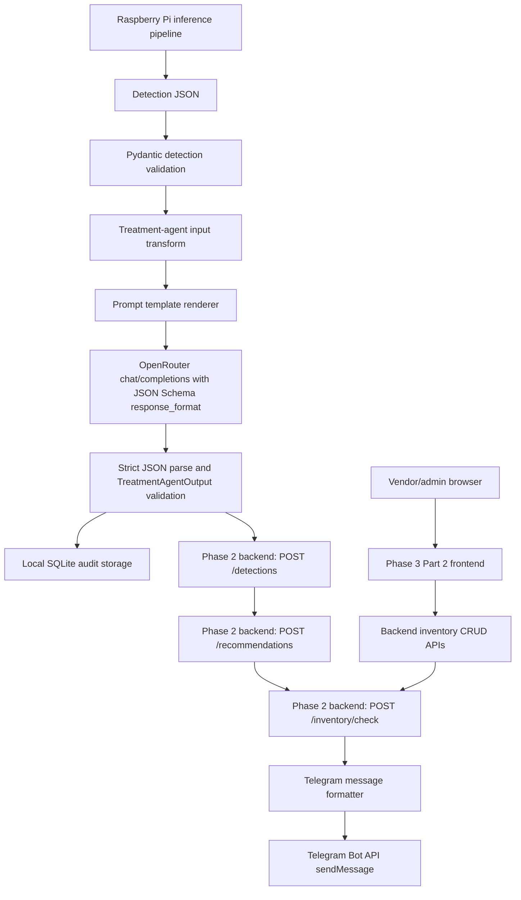
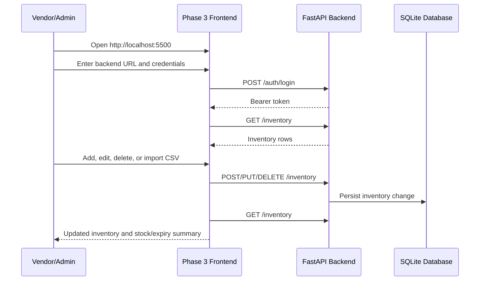

# Phase 3 Technical Documentation

## 1. System Overview

Phase 3 is the Raspberry Pi-side treatment recommendation and notification
module for the Plant Disease Detection Rover prototype.

It starts after the Raspberry Pi has already captured an image, run local
offline disease inference, estimated disease severity, and produced the
documented detection JSON. Phase 3 does not perform image inference or rover
movement. Its job is to turn a validated detection result into a structured AI
treatment recommendation, persist trace data, synchronize the result with the
Phase 2 backend, check inventory, and send a farmer-readable Telegram message.

The requirements document is the source of truth. This implementation preserves
the documented JSON shapes for:

- detection input,
- treatment-agent input,
- treatment-agent output,
- inventory check request/response,
- recommendation upload payload,
- and Telegram message content.

The LLM recommendation is explicitly treated as prototype support for
demonstration and inventory planning. It must not be represented as certified
agricultural advice.

Phase 3 Part 2 adds a lightweight vendor/admin frontend for inventory updates.
This is included because the requirements document states that vendors should
not manually edit backend code or database rows, and should update stock through
simple frontend forms and CSV/Excel-style bulk import. The implemented frontend
focuses only on inventory management needed by the treatment notification flow.
It does not add order management, payment handling, multi-vendor comparison, or
a full analytics dashboard.

## 2. Architecture Flow



The local SQLite audit database is updated throughout the run. Malformed model
responses, backend failures, and Telegram failures are not silently discarded.
They are logged and stored when a run has already been created.

The frontend is intentionally separate from the treatment-agent execution path.
Its purpose is to keep vendor inventory accurate so `/inventory/check` can return
real availability and pricing when the treatment agent recommends medicine.

## 3. Module Responsibilities

### `app/config/settings.py`

Loads environment-driven runtime settings. It also includes a minimal `.env`
file loader so the prototype does not require an additional dependency.

Important environment variables:

- `OPENROUTER_API_KEY`
- `OPENROUTER_BASE_URL`
- `OPENROUTER_MODEL`
- `OPENROUTER_TEMPERATURE`
- `OPENROUTER_MAX_TOKENS`
- `BACKEND_BASE_URL`
- `BACKEND_USERNAME`
- `BACKEND_PASSWORD`
- `TELEGRAM_BOT_TOKEN`
- `TELEGRAM_CHAT_ID`
- `AUDIT_DB_PATH`
- `REQUEST_TIMEOUT_SECONDS`
- `RETRY_ATTEMPTS`
- `RETRY_BACKOFF_SECONDS`

### `app/schemas`

Contains Pydantic models with `extra="forbid"` for strict schema validation.

Key schemas:

- `DetectionCreate`: matches the documented Raspberry Pi detection JSON.
- `TreatmentAgentInput`: matches the documented prompt input JSON.
- `TreatmentAgentOutput`: validates the structured LLM output.
- `InventoryCheckRequest`: matches the Phase 2 backend inventory check input.
- `InventoryCheckResponse`: validates inventory availability and price output.
- `TreatmentPipelineResult`: summarizes one completed pipeline run.

### `app/prompts/treatment_prompt.py`

Stores prompt text outside business logic. The prompt:

- requires JSON-only output,
- forbids markdown and conversational text,
- asks for kg/acre quantities only,
- includes prototype safety framing,
- and embeds the generated JSON Schema for `TreatmentAgentOutput`.

### `app/clients/openrouter.py`

Builds and sends the OpenRouter request. The request uses:

- configurable model,
- low configurable temperature,
- OpenAI-compatible chat completions path,
- JSON Schema structured output via `response_format`,
- retry policy,
- timeout handling,
- and strict response validation.

`parse_openrouter_response()` accepts only:

- a JSON object in `choices[0].message.content`, or
- a string that can be parsed by `json.loads`.

It does not strip markdown, repair pseudo-JSON, or guess missing fields.

### `app/storage/audit_store.py`

Persists trace records in SQLite. Each run stores:

- `run_id`,
- model name,
- detection JSON,
- treatment-agent input JSON,
- OpenRouter request JSON,
- raw OpenRouter response JSON,
- parsed treatment JSON,
- backend sync result,
- inventory result,
- Telegram delivery result,
- validation status,
- and error message when applicable.

This supports debugging after a demo failure without needing to reproduce the
exact network or model response.

### `app/integrations/backend.py`

Handles Phase 2 FastAPI backend calls:

- `POST /auth/login`
- `POST /detections`
- `GET /detections` for duplicate `session_id` recovery
- `POST /recommendations`
- `POST /inventory/check`
- optional `POST /notifications/telegram`

The pipeline uses direct Telegram delivery by default because the requirements
allow Telegram to be triggered from the backend or directly from the Pi. The
Phase 2 backend currently exposes a scaffold notification endpoint, so direct Pi
delivery is the functional Phase 3 path.

### `app/notifications/telegram.py`

Formats a farmer-readable message and sends it through Telegram Bot API
`sendMessage` when credentials are configured.

The message includes:

- crop,
- disease,
- severity and infected area percent,
- grid position,
- treatment names,
- kg/acre quantity,
- inventory availability,
- required quantity,
- estimated price,
- application schedule,
- safety instructions,
- and disclaimer.

If credentials are missing, delivery is skipped gracefully and the result states
that Telegram is not configured.

### `app/services/transformer.py`

Contains deterministic conversions:

- detection JSON to treatment-agent input JSON,
- treatment output to inventory check request.

Required inventory quantity is calculated as:

```text
quantity_kg_per_acre * farm_size_acres
```

This keeps the LLM output in kg/acre as required while still sending total
quantity needs to inventory checking.

### `app/services/pipeline.py`

Coordinates the end-to-end Phase 3 workflow:

1. validate detection JSON,
2. build treatment-agent input,
3. create an audit run,
4. call OpenRouter,
5. validate treatment output,
6. upload detection to backend,
7. upload recommendation to backend,
8. request inventory check,
9. build Telegram message,
10. send Telegram message,
11. finalize audit status.

### `app/main.py`

Provides a CLI entrypoint:

```powershell
python -m phase3.app.main --input phase3/examples/detection_sample.json --farm-size-acres 1.0 --number-of-plants 500
```

For isolated OpenRouter validation:

```powershell
python -m phase3.app.main --input phase3/examples/detection_sample.json --farm-size-acres 1.0 --number-of-plants 500 --skip-backend --skip-telegram
```

### `frontend/`

Provides the Phase 3 Part 2 usability layer for vendor inventory management.
It is a static HTML/CSS/JavaScript page that talks to the existing Phase 2
backend with bearer-token authentication.

Responsibilities:

- login through `/auth/login`,
- list inventory through `/inventory`,
- create inventory through `POST /inventory`,
- update inventory through `PUT /inventory/{id}`,
- delete inventory through `DELETE /inventory/{id}`,
- import CSV/TSV rows by calling create/update endpoints,
- show low-stock and expiry summaries.

Important files:

- `frontend/index.html`: page structure and form controls.
- `frontend/styles.css`: responsive, work-focused visual design.
- `frontend/app.js`: login, inventory CRUD, CSV parsing, validation, and API calls.
- `frontend/sample_inventory.csv`: sample import file aligned with the documented CSV format.
- `frontend/README.md`: short run instructions for the frontend.

The frontend currently performs CSV/TSV import in the browser and then calls the
existing inventory create/update endpoints row by row. Excel workbooks should be
exported to CSV before import. This keeps the prototype dependency-free and
avoids adding heavy file-parsing infrastructure. It also remains compatible with
the documented inventory schema:

```csv
medicine_name,stock_quantity_kg,price_per_kg,expiry_date
Mancozeb 75% WP,15,220,2026-11-05
Metalaxyl + Mancozeb,8,460,2026-12-15
Neem Cake,40,45,2027-05-01
```

### Backend CORS Support

The backend now allows the static frontend to call authenticated API endpoints
from local development origins. The default allowed origins are:

- `http://localhost:5500`
- `http://127.0.0.1:5500`
- `http://localhost:8001`
- `http://127.0.0.1:8001`

Configure `FRONTEND_CORS_ORIGINS` on the backend if a different frontend host or
port is used.

## 4. Prompt Engineering

The treatment prompt is separated into a system prompt and a rendered user
prompt.

The system prompt defines behavior:

- act as the treatment recommendation agent for this prototype,
- output only JSON,
- do not include markdown,
- use kg/acre only,
- include a disclaimer,
- and avoid presenting the output as certified advice.

The user prompt includes:

- the validated treatment-agent input JSON,
- the generated output JSON Schema,
- and short non-negotiable rules.

The OpenRouter call also sends `response_format` with JSON Schema. The prompt is
therefore not the only enforcement layer. The actual enforcement chain is:

```text
Pydantic input validation -> prompt JSON Schema -> OpenRouter structured output -> json.loads -> Pydantic output validation
```

Temperature defaults to `0.2` to reduce variation. The requirements recommend
the `0.1` to `0.3` range, and `.env.example` keeps the default inside that range.

## 5. JSON Schema Strategy

The implementation uses Pydantic as the schema authority inside code.

### Detection JSON

Validated by `DetectionCreate`.

Important fields:

- `session_id`
- `device_id`
- `timestamp`
- `grid_position.row_index`
- `grid_position.plant_index`
- `crop`
- `disease`
- `confidence`
- `severity.label`
- `severity.infected_area_percent`
- `image`
- `model`

Extra fields are rejected to preserve compatibility with the documented schema.

### Treatment Agent Input JSON

Validated by `TreatmentAgentInput`.

Fields:

- `crop`
- `disease`
- `severity_label`
- `infected_area_percent`
- `farm_size_acres`
- `number_of_plants`
- `location_context.country`
- `location_context.language`
- `required_units`

`required_units` is restricted to `kg/acre`.

### Treatment Agent Output JSON

Validated by `TreatmentAgentOutput`.

Fields:

- `crop`
- `disease`
- `severity_label`
- `recommendations`
- `disclaimer`

Each recommendation includes:

- `type`
- `medicine_name`
- `active_ingredient`
- `quantity_kg_per_acre`
- `application_frequency`
- `safety_instructions`

The schema does not invent extra business fields. Availability and price are
not requested from the LLM because those are backend inventory responsibilities.

### Backend Payloads

The recommendation upload to `/recommendations` uses the existing Phase 2 schema:

- `detection_session_id`
- `model_provider`
- `model_name`
- `raw_request_json`
- `raw_response_json`

Inventory checking uses the existing Phase 2 schema:

- `session_id`
- `vendor_id`
- `treatment_recommendation_id`
- `items[].medicine_name`
- `items[].required_quantity_kg`

## 6. Setup Instructions

### Install dependencies

```powershell
cd phase3
python -m venv .venv
.\.venv\Scripts\Activate.ps1
python -m pip install --upgrade pip
python -m pip install -r requirements.txt
```

### Configure environment

```powershell
Copy-Item .env.example .env
```

Edit `.env`.

Minimum OpenRouter configuration:

```env
OPENROUTER_API_KEY=your_openrouter_key
OPENROUTER_MODEL=google/gemini-3.1-flash-lite
OPENROUTER_TEMPERATURE=0.2
OPENROUTER_MAX_TOKENS=1800
```

Backend configuration:

```env
BACKEND_BASE_URL=http://localhost:8000
BACKEND_USERNAME=admin
BACKEND_PASSWORD=admin123
BACKEND_VENDOR_ID=vendor_001
```

Optional backend frontend configuration:

```env
FRONTEND_CORS_ORIGINS=http://localhost:5500,http://127.0.0.1:5500
```

Telegram configuration:

```env
TELEGRAM_BOT_TOKEN=123456:bot-token
TELEGRAM_CHAT_ID=123456789
```

### Start the Phase 2 backend

In another terminal:

```powershell
cd backend
.\.venv\Scripts\Activate.ps1
uvicorn app.main:app --host 0.0.0.0 --port 8000
```

### Start the Phase 3 Part 2 frontend

From the workspace root:

```powershell
.\phase3\.venv\Scripts\python.exe -m http.server 5500 -d phase3\frontend
```

Open:

```text
http://localhost:5500
```

The backend allows this local frontend origin through CORS. Configure
`FRONTEND_CORS_ORIGINS` on the backend if a different frontend port is used.

Login with the same backend credentials used for the API. For the local seeded
prototype database, the default admin credentials are:

```text
username: admin
password: admin123
```

Inventory mutation requires an `admin` or `vendor` role. Viewer/farmer users can
read data where backend permissions allow it, but should not be used for stock
updates.

The backend must have an inventory item whose `medicine_name` matches the LLM
recommendation name after lowercase/whitespace normalization. Phase 2 does not
implement synonym matching.

### Run Phase 3

From the workspace root:

```powershell
python -m phase3.app.main --input phase3/examples/detection_sample.json --farm-size-acres 1.0 --number-of-plants 500
```

## 7. Phase 3 Part 2 Frontend Workflow

The frontend exists to solve a practical prototype problem: the treatment agent
can recommend medicine names, but Telegram notifications can only show useful
availability and price if the backend inventory table is kept up to date. The
frontend gives the vendor/admin a simple page to maintain that table.

### Frontend Execution Flow



### Manual Add/Edit Flow

The vendor fills:

- medicine name,
- stock quantity in kg,
- price per kg in INR,
- expiry date.

For a new medicine the frontend sends:

```text
POST /inventory
```

For an existing medicine it sends:

```text
PUT /inventory/{id}
```

The backend remains the validation authority. If a medicine name conflicts with
an existing normalized name, the backend returns a conflict response and the UI
shows the error in the activity log.

### CSV Import Flow

The frontend accepts `.csv`, `.tsv`, or `.txt` files with these columns:

- `medicine_name`
- `stock_quantity_kg`
- `price_per_kg`
- `expiry_date`

Before import, the browser validates:

- medicine name is present,
- stock quantity is numeric and non-negative,
- price is numeric and non-negative,
- expiry date uses `YYYY-MM-DD`.

For each valid row:

- if the medicine already exists after lowercase/whitespace normalization, the
  frontend calls `PUT /inventory/{id}`;
- otherwise it calls `POST /inventory`.

This design is conservative. The requirements mention CSV/Excel import, but the
current lightweight implementation asks Excel users to export CSV first. That
keeps the prototype easy to run and avoids adding spreadsheet parsing packages
to the backend.

### Frontend Data Boundaries

The frontend does not call OpenRouter and does not send Telegram messages. Those
remain Phase 3 treatment pipeline responsibilities. The frontend only maintains
the inventory data that the pipeline later uses through `/inventory/check`.

## 8. Execution Flow Walkthrough

### Step 1: Detection JSON creation

The Raspberry Pi inference pipeline produces the detection JSON. Phase 3 accepts
the JSON from a file in the CLI path or as a dictionary when called from Python.

### Step 2: Input validation

`DetectionCreate.model_validate()` checks required fields, value ranges, nested
objects, and extra fields. Invalid payloads stop the pipeline before OpenRouter
or backend calls.

### Step 3: Treatment input transform

`detection_to_treatment_input()` copies only documented fields into
`TreatmentAgentInput` and adds farm-level values supplied by the caller.

### Step 4: Prompt generation

`render_treatment_user_prompt()` serializes the validated input and embeds the
Pydantic-generated JSON Schema. This keeps prompt content maintainable and
traceable.

### Step 5: OpenRouter API call

`OpenRouterClient.generate_treatment()` sends the chat completion request to:

```text
POST https://openrouter.ai/api/v1/chat/completions
```

The request includes:

- bearer token,
- model,
- temperature,
- messages,
- and JSON Schema response format.

### Step 6: Structured output validation

The response parser extracts `choices[0].message.content`. It then parses JSON
and validates against `TreatmentAgentOutput`. Invalid JSON, missing fields,
wrong types, and extra fields are rejected.

### Step 7: Local audit storage

The audit database stores the input, OpenRouter request, raw response, parsed
response, and status. This happens before backend sync so the model result can
be inspected even if the local network is down.

### Step 8: Backend synchronization

When backend credentials are configured, the pipeline:

1. logs in through `/auth/login`,
2. uploads detection JSON to `/detections`,
3. uploads recommendation JSON to `/recommendations`,
4. sends an inventory check to `/inventory/check`.

If `/detections` returns a duplicate `session_id` conflict, the client fetches
the latest detections and reuses the existing record if found. This makes demo
reruns less fragile without changing backend schema.

### Step 9: Telegram notification

The Telegram formatter combines detection, treatment, and inventory data into a
plain text message. It sends the message through:

```text
POST https://api.telegram.org/bot<token>/sendMessage
```

No Markdown parse mode is used, reducing formatting-related delivery failures.

### Step 10: Inventory maintenance through frontend

Before or after treatment-agent demo runs, the vendor/admin can update stock
through `http://localhost:5500`. Matching medicine names are important because
the backend currently performs exact lowercase/whitespace-normalized matching.

For the sample treatment output, useful inventory names include:

- `Mancozeb 75% WP`
- `Metalaxyl + Mancozeb`

If those names exist in inventory with sufficient stock, future Telegram
messages will show availability and estimated price instead of `Not available`.

## 9. Error Handling and Debugging

### OpenRouter failures

Possible causes:

- missing `OPENROUTER_API_KEY`,
- network failure,
- timeout,
- model unavailable,
- malformed model output,
- schema mismatch.

Behavior:

- request failures are retried according to `RETRY_ATTEMPTS`,
- malformed JSON is rejected,
- schema mismatch is rejected,
- audit status becomes `openrouter_failed` when a run has started.

Debugging:

- inspect console structured logs,
- inspect `logs/phase3_audit.db`,
- verify selected model supports structured outputs,
- run with `--skip-backend --skip-telegram` to isolate the LLM call.

### Backend failures

Possible causes:

- backend not running,
- wrong `BACKEND_BASE_URL`,
- wrong credentials,
- detection schema mismatch,
- missing detection foreign key,
- inventory item names not matching.

Behavior:

- backend calls are retried,
- failures are logged,
- audit status becomes `backend_sync_failed`,
- the error is raised so the caller knows the pipeline did not finish.

Debugging:

- open `http://localhost:8000/docs`,
- test `/auth/login`,
- confirm inventory item names,
- check backend logs.

### Telegram failures

Possible causes:

- missing bot token,
- missing chat ID,
- bot not started by the recipient,
- Telegram API timeout.

Behavior:

- missing credentials produce a graceful skipped result,
- API failures are retried,
- delivery failure is logged and stored without corrupting the validated
  treatment recommendation.

Debugging:

- confirm `TELEGRAM_BOT_TOKEN`,
- confirm `TELEGRAM_CHAT_ID`,
- send a manual `/start` to the bot,
- inspect `telegram_result_json` in the audit database.

### Frontend failures

Possible causes:

- backend server is not running,
- backend URL is wrong,
- CORS origins do not include the frontend URL,
- login credentials are wrong,
- logged-in user does not have `admin` or `vendor` role,
- CSV headers are misspelled,
- CSV expiry date is not `YYYY-MM-DD`,
- duplicate medicine names conflict after backend normalization.

Behavior:

- errors are shown in the frontend activity log,
- invalid CSV rows are previewed and blocked before import,
- backend validation errors are not hidden or rewritten.

Debugging:

- open `http://localhost:8000/docs` and confirm the backend is reachable,
- open `http://localhost:5500` and confirm the frontend loads,
- check that `FRONTEND_CORS_ORIGINS` includes the frontend origin,
- try logging in with `admin/admin123` on the local seeded database,
- use `frontend/sample_inventory.csv` for a known-good import file.

## 10. Testing

Run:

```powershell
python -m pytest phase3/tests
```

Covered behaviors:

- detection schema validation,
- rejection of extra fields,
- treatment input transform,
- inventory payload generation,
- OpenRouter JSON parsing,
- malformed JSON rejection,
- schema mismatch rejection,
- structured output request construction,
- prompt-template rendering,
- retry behavior,
- Telegram farmer-message content,
- pipeline audit persistence.

The tests do not call live OpenRouter, backend, or Telegram services. They use
deterministic sample data and fakes where network behavior would otherwise make
tests unstable.

Frontend verification:

```powershell
.\phase3\.venv\Scripts\python.exe -m http.server 5500 -d phase3\frontend
```

Then confirm:

- `http://localhost:5500` loads,
- backend login succeeds,
- `/inventory` loads through the frontend,
- sample CSV rows can be added or updated.

JavaScript syntax can be checked with:

```powershell
node --check phase3\frontend\app.js
```

## 11. Operational Behavior

The module is intentionally synchronous and lightweight. This is appropriate for
the prototype because the rover stops at a plant, captures one image, and then
processes one detection session at a time.

The pipeline fails loudly for validation, OpenRouter, and backend sync errors.
Telegram delivery is treated as a notification side effect: missing credentials
or delivery failure are recorded without changing the validated recommendation.

All secrets must come from environment variables or `.env`. No secrets are
hardcoded.

HTTP client library logs are suppressed below warning level so local demo logs
do not print full Telegram Bot API URLs that contain the bot token.

The frontend stores the backend URL in browser `localStorage` and the bearer
token in browser `sessionStorage`. This is acceptable for the local prototype
but should be revisited before any production or shared deployment.

## 12. Documented Assumptions

- The Phase 2 backend remains the persistence authority for dashboard-visible
  detections, recommendations, and inventory checks.
- Direct Pi-side Telegram delivery is used because the requirements allow either
  backend-triggered or Pi-triggered notification.
- Medicine inventory matching remains the Phase 2 exact normalized-name behavior.
  No synonym table is implemented in Phase 3.
- The LLM only recommends treatment and dosage fields. Availability and price
  are backend inventory responsibilities.
- Model availability and price can change on OpenRouter. The selected model is
  configurable and should be verified during setup for a real demo.
- Phase 3 Part 2 CSV import is implemented in the browser by calling existing
  inventory CRUD endpoints. A dedicated `/inventory/import` backend endpoint can
  be added later if the project needs server-side file upload.
- Excel import means exporting Excel data as CSV for this prototype iteration.

## 13. Future Compatibility Notes

Planned extension points:

- replace direct Telegram delivery with backend-triggered delivery when the
  backend notification endpoint is upgraded,
- add model metadata verification through OpenRouter Models API during setup,
- add a medicine synonym table after inventory naming problems are observed,
- add a backend `/inventory/import` endpoint for server-side CSV/Excel parsing
  if bulk upload becomes larger or needs audit records,
- expand the static frontend into an admin dashboard with detection history and
  recommendation history,
- connect the Python service directly to the Raspberry Pi session store,
- add local language notification generation in a future phase,
- add agronomist-reviewed treatment rules or a curated treatment database.

Out-of-scope items deliberately not implemented:

- ML training,
- TFLite inference,
- camera capture,
- autonomous navigation,
- GPS,
- order management dashboards,
- multi-vendor comparison,
- order placement,
- payment flow,
- and certified agronomist approval.
