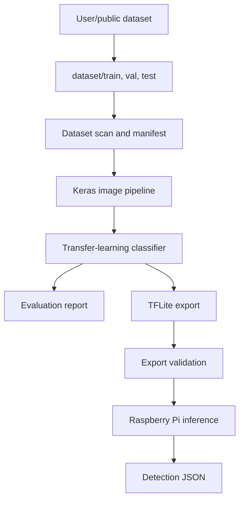

# Phase 4 ML Model Training and Edge Inference Documentation

## A. System Overview

Phase 4 builds the local disease-classification model for the Plant Disease Detection Rover prototype. It is intentionally limited to the requirements document's Phase 4 scope:

- prepare and validate crop-disease image datasets,
- train a lightweight TensorFlow/Keras classifier,
- evaluate validation/test performance,
- export a TensorFlow Lite model for Raspberry Pi CPU inference,
- run offline image inference on the Raspberry Pi,
- emit the documented detection JSON for later Phase 3/Phase 6 integration.

**Implementation status:** Completed.

Completed Phase 4 tasks:

- dataset preparation,
- dataset validation,
- data augmentation,
- MobileNetV3 transfer-learning model training,
- model evaluation,
- TensorFlow Lite export,
- inference pipeline validation.

The completed model classifies three PlantVillage potato crop-disease classes: `potato_healthy`, `potato_early_blight`, and `potato_late_blight`. This matches the requirements document's version 1 strategy: one multiclass classifier that predicts crop and disease together. The Phase 4 code does not implement backend APIs, OpenRouter calls, Telegram notification, rover movement, GPS, dashboards, or inventory workflows.

Raspberry Pi compatibility drives the design. The training code runs on a laptop or workstation, while the deployed artifact is a `.tflite` model plus `labels.json`. On the Pi, inference uses `tflite-runtime` when available and falls back to TensorFlow's Lite interpreter on development machines.

The documented results in this report come from the completed PlantVillage Phase 4 run. Dataset files and trained binaries are not committed to the repository.

## B. Architecture Flow



Component paths:

- `phase4/app/dataset.py`: dataset validation, corrupt-image detection, duplicate hashing, manifest generation.
- `phase4/app/augmentation.py`: field-safe Keras augmentation layers.
- `phase4/app/models.py`: MobileNet/EfficientNet-style classifier construction.
- `phase4/app/train.py`: config-driven training, checkpoints, TensorBoard, label export.
- `phase4/app/evaluate.py`: accuracy, precision, recall, F1, confusion matrix, inference timing.
- `phase4/app/export_tflite.py`: TFLite conversion, quantization, shape/dtype validation, size reporting.
- `phase4/app/inference.py`: Raspberry Pi compatible TFLite prediction and detection JSON generation.
- `phase4/app/severity.py`: lightweight severity scaffold only; Phase 5 should replace or validate it.

## C. Dataset Documentation

The completed Phase 4 dataset uses PlantVillage potato images. The initial dataset had a significant class imbalance:

| Class | Original Images |
|---|---:|
| Potato Healthy | 152 |
| Potato Late Blight | 1001 |

The imbalance was addressed by augmenting healthy potato leaf images. The final dataset includes a third PlantVillage class, potato early blight:

| Class | Images |
|---|---:|
| Potato Healthy | 1200 |
| Potato Early Blight | 1000 |
| Potato Late Blight | 1001 |
| Total | 3101 |

Final structure:

```text
dataset/
├── train/
│   ├── potato_healthy/
│   ├── potato_early_blight/
│   └── potato_late_blight/
├── val/
│   ├── potato_healthy/
│   ├── potato_early_blight/
│   └── potato_late_blight/
└── test/
    ├── potato_healthy/
    ├── potato_early_blight/
    └── potato_late_blight/
```

Class names must use:

```text
<crop>_<disease_or_healthy>
```

Examples:

- `potato_healthy`
- `potato_early_blight`
- `potato_late_blight`

The scanner validates the folder naming pattern, skips unreadable/corrupt images, computes SHA-256 hashes, flags duplicates, and writes a CSV manifest. Duplicate handling is awareness-first: it does not delete files automatically because public datasets may contain legitimate near-duplicates or curated splits. The developer should review the manifest before removing images.

Run:

```powershell
python -m phase4.app.dataset --dataset-dir dataset --manifest phase4/runs/dataset_manifest.csv
```

Public dataset risk:

Public plant datasets often use clean lab backgrounds. The rover will capture downward-facing images with soil, shadows, overlap, and local lighting. Training only on clean public images may produce weak field performance. The documentation and final report should explicitly mention this limitation and recommend adding rover-style field images later.

## D. Augmentation Strategy

The completed Phase 4 run applied augmentation to healthy potato leaf images to reduce the class imbalance between healthy and late blight samples. The augmentation pipeline uses conservative transforms that reflect plausible rover image variation:

- horizontal flip: leaf orientation can vary,
- rotation from -15 degrees to +15 degrees: camera and plant angle can vary,
- brightness adjustment: outdoor lighting changes,
- contrast adjustment: leaf texture and exposure vary,
- resizing: model input must remain fixed.

The implementation avoids unrealistic heavy warping, extreme color shifts, and synthetic disease patterns. Soil/background variation is represented indirectly through crop/zoom/lighting transforms; future dataset collection should add real soil-background images instead of relying on artificial generation.

## E. Model Architecture Explanation

The completed classifier is MobileNetV3 transfer-learning based. It uses a pretrained lightweight backbone and replaces the classification head with a project-specific three-class softmax head.

Implemented model:

- architecture: MobileNetV3,
- framework: TensorFlow 2.17.1,
- input size: `224 x 224 x 3`,
- classes: 3,
- output labels: `potato_healthy`, `potato_early_blight`, `potato_late_blight`.

Supported code backbones remain:

- `mobilenetv3small`: implemented Raspberry Pi baseline.
- `mobilenetv2`: widely supported fallback.
- `efficientnetb0`: EfficientNet-style baseline when available in the local TensorFlow build.

The requirements document mentions EfficientNet-Lite0 as a recommended style. Exact EfficientNet-Lite0 is not added as a hard dependency here because TensorFlow/Keras installations do not always ship it as a built-in application model. The code keeps the backbone interface modular so an exact Lite0 source can be added later without changing the dataset, evaluation, export, or Pi inference flow.

Why lightweight models:

- Raspberry Pi 4 has limited CPU and memory compared with a laptop/GPU.
- The rover processes one still image after stopping, so a compact CNN is enough for the prototype.
- Smaller models export cleanly to TFLite and support post-training quantization.

## F. Training Workflow Explanation

Training is configuration-driven through `phase4/configs/default.json`.

Important fields:

- `dataset_dir`: root dataset path.
- `image_size`: model input size, default `[224, 224]`.
- `batch_size`: default `16`, conservative for low-memory machines.
- `backbone`: default `mobilenetv3small`.
- `epochs`: training epochs.
- `weights`: default `imagenet`; set to `null` only if offline training without pretrained weights is required.
- `output_dir`: run artifacts.

Completed training configuration:

| Parameter | Value |
|---|---|
| Model | MobileNetV3 transfer learning |
| Framework | TensorFlow 2.17.1 |
| Input size | 224 x 224 x 3 |
| Classes | 3 |
| Epochs | 20 |
| Dataset source | PlantVillage |
| Final dataset size | 3101 images |

Run:

```powershell
python -m phase4.app.train --config phase4/configs/default.json --dataset-dir dataset --output-dir phase4/runs/mobilenetv3
```

Training outputs:

- `resolved_config.json`: exact config used.
- `labels.json`: class order used by the model.
- `training_history.csv`: epoch metrics.
- `tensorboard/`: TensorBoard logs.
- `checkpoints/best.keras`: best checkpoint by validation accuracy when validation exists.
- `saved_model.keras`: final Keras model.

Reproducibility:

- Python, NumPy, and TensorFlow seeds are set.
- The resolved config is saved with the run.
- Label order is exported and must travel with the TFLite model.

Completed training classes:

- `potato_healthy`
- `potato_early_blight`
- `potato_late_blight`

Limitations:

- Determinism can still vary across TensorFlow versions and hardware kernels.
- Results should be reproduced from the local dataset and artifacts during final evaluation.

## G. Evaluation Workflow

Evaluation supports `val` or `test` splits and writes a JSON report:

```powershell
python -m phase4.app.evaluate --model phase4/runs/mobilenetv3/saved_model.keras --dataset-dir dataset --split test --output-dir phase4/runs/mobilenetv3/evaluation
```

Metrics:

- overall accuracy through the classification report,
- per-class precision,
- per-class recall,
- per-class F1,
- confusion matrix,
- mean per-image inference time on the evaluation machine.

The timing value is useful for comparing model variants on the same machine. It is not a Raspberry Pi benchmark unless the command is run on the Pi.

Completed Phase 4 results:

| Model Run | Dataset Size | Classes | Test Accuracy | Test Loss |
|---|---:|---:|---:|---:|
| Initial model | 302 | 2 | 88.00% | Not recorded |
| Improved MobileNetV3 model | 3101 | 3 | 97.37% | 0.057 |

The improved model increased the number of classes from two to three while improving test accuracy by 9.37 percentage points.

## H. TFLite Export Explanation

TensorFlow Lite is required because the Raspberry Pi should run offline CPU inference without loading a full desktop training stack. The exporter supports:

- `dynamic_range`: default post-training quantization, simple and robust.
- `float16`: smaller model on compatible runtimes.
- `int8`: full integer quantization, requires representative training images.

Run:

```powershell
python -m phase4.app.export_tflite --model phase4/runs/mobilenetv3/saved_model.keras --output phase4/runs/mobilenetv3/model.tflite
```

The export validator allocates the TFLite interpreter, runs a zero-valued input through the model, and reports:

- input shape,
- input dtype,
- output shape,
- output dtype,
- model size in bytes.

This confirms that the artifact can be loaded and invoked, but it does not prove model accuracy.

Completed export result:

| Export Item | Value |
|---|---|
| Export status | Successful |
| Exported model | `model.tflite` |
| Input shape | `[1, 224, 224, 3]` |
| Output shape | `[1, 3]` |
| Model size | 1,110,664 bytes, approximately 1.1 MB |
| Deployment target | Raspberry Pi edge inference |
| Operation mode | Offline |

## I. Raspberry Pi Inference Explanation

The Pi inference script:

1. loads the `.tflite` model,
2. loads `labels.json`,
3. reads and resizes the image to raw RGB pixel values,
4. quantizes input only when the TFLite input dtype requires it,
5. invokes the interpreter,
6. maps the top class to `crop` and `disease`,
7. estimates severity with the lightweight OpenCV scaffold,
8. writes the documented detection JSON.

Run:

```powershell
python -m phase4.app.inference --model phase4/runs/mobilenetv3/model.tflite --labels phase4/runs/mobilenetv3/labels.json --image captures/sample.jpg --row-index 1 --plant-index 7 --output phase4/runs/inference/detection.json
```

The output preserves the requirements document's fields:

- `session_id`
- `device_id`
- `timestamp`
- `grid_position`
- `crop`
- `disease`
- `confidence`
- `severity`
- `image`
- `model`

An extra `runtime.inference_time_ms` field is included for local traceability. It does not replace or rename any required detection fields.

Backbone-specific preprocessing is embedded inside the Keras/TFLite graph, so Raspberry Pi code does not need to know whether the model uses MobileNetV2, MobileNetV3Small, or an EfficientNet-style backbone.

Validated inference output:

```json
{
  "class_name": "potato_late_blight",
  "crop": "potato",
  "disease": "late_blight",
  "confidence": 0.999964,
  "inference_time_ms": 11.943
}
```

The inference pipeline is functional. The validated prediction confidence exceeded 99.99%, and average inference time was approximately 12 ms for the tested inference path.

## J. Severity Estimation Handling

Phase 4 only includes a lightweight scaffold because full severity estimation belongs to Phase 5.

Current method:

- `phase4/app/severity.py`
- method name: `opencv_color_threshold_v1`
- estimates a rough diseased-area percentage using simple HSV color thresholds.

This is not a validated segmentation system. It exists so inference can emit schema-compatible detection JSON and so Phase 5 has a clear replacement point. Field validation with manually checked images is required before using severity as a project result.

Severity scale follows the requirements document:

| Label | Infected leaf area |
|---|---:|
| healthy | 0% |
| very_low | >0% to 1% |
| low | >1% to 5% |
| moderate | >5% to 20% |
| high | >20% to 40% |
| severe | >40% |

## K. Setup Instructions

Create an environment:

```powershell
cd "C:\Users\ROHAN A S GOWDA\OneDrive\Dokumen\D&I"
python -m venv phase4\.venv
.\phase4\.venv\Scripts\Activate.ps1
python -m pip install --upgrade pip
python -m pip install -r phase4\requirements.txt
```

Prepare data:

```powershell
dataset/
  train/
  val/
  test/
```

Validate data:

```powershell
python -m phase4.app.dataset --dataset-dir dataset --manifest phase4/runs/dataset_manifest.csv
```

Train:

```powershell
python -m phase4.app.train --config phase4/configs/default.json --dataset-dir dataset --output-dir phase4/runs/mobilenetv3
```

Evaluate:

```powershell
python -m phase4.app.evaluate --model phase4/runs/mobilenetv3/saved_model.keras --dataset-dir dataset --split test --output-dir phase4/runs/mobilenetv3/evaluation
```

Export:

```powershell
python -m phase4.app.export_tflite --model phase4/runs/mobilenetv3/saved_model.keras --output phase4/runs/mobilenetv3/model.tflite
```

Raspberry Pi setup:

```bash
python3 -m venv phase4-venv
. phase4-venv/bin/activate
python -m pip install --upgrade pip
python -m pip install tflite-runtime opencv-python-headless numpy
```

Pi inference:

```bash
python -m phase4.app.inference --model model.tflite --labels labels.json --image captures/sample.jpg --row-index 1 --plant-index 7 --output detection.json
```

## L. Partitioned Development Strategy

The implementation is split into independent stages to conserve Codex usage and keep future work safe:

1. Dataset pipeline: can be run before TensorFlow is installed and catches corrupt images early.
2. Training pipeline: depends on TensorFlow and writes self-contained run artifacts.
3. Evaluation pipeline: consumes a saved model and dataset split without retraining.
4. TFLite export: consumes the saved Keras model and can be repeated for different quantization modes.
5. Raspberry Pi inference: consumes only `.tflite`, `labels.json`, and an image.
6. Documentation/tests: explain and verify each isolated piece.

This avoids regenerating large files or retraining models when only export, inference, or documentation changes. Future contributors can work on one part at a time.

## M. Troubleshooting

Dataset split missing:

- Ensure `dataset/train` exists before training.
- `val` and `test` are optional for scanning, but strongly recommended for meaningful evaluation.

Invalid class folder:

- Rename folders to `<crop>_<disease>`, for example `potato_late_blight`.

Corrupted images:

- Run the dataset scanner and inspect `corrupt_paths`.
- Replace or remove unreadable files.

Class imbalance:

- Review `class_counts` in scanner logs and the manifest.
- Prefer collecting more images for underrepresented classes before relying on augmentation.

Training instability:

- Reduce learning rate.
- Reduce batch size on low-memory systems.
- Start with `mobilenetv3small`.
- Verify labels are not mixed between classes.

Pretrained weights fail to download:

- Install with internet access or set `"weights": null` in config.
- Document that training from scratch may require more data and epochs.

TFLite conversion failure:

- Try `dynamic_range` quantization first.
- Use `int8` only when `dataset/train` exists for representative calibration.
- Confirm custom layers are not introduced without TFLite support.

Inference mismatch:

- Confirm `labels.json` came from the same training run as the model.
- Confirm `image_size` in config matches training.
- Confirm input dtype handling in the TFLite validation report.

Raspberry Pi slow inference:

- Use `mobilenetv3small`.
- Use dynamic range or int8 quantization.
- Keep input size at `224x224` or lower after validation.
- Avoid running full TensorFlow on the Pi when `tflite-runtime` is enough.

## N. Future Compatibility Notes

Phase 5 severity estimation can replace `estimate_severity_opencv` with a validated segmentation or hybrid method while keeping the same detection JSON fields.

Phase 6 rover integration can call `phase4.app.inference` after camera capture and before local session storage/backend sync.

Future model expansion can add:

- exact EfficientNet-Lite0 if a stable local source is available,
- crop classifier plus per-crop disease classifiers,
- rover-style field-image retraining,
- model comparison reports across backbones and quantization modes.

Any future expansion should preserve the detection JSON schema unless the requirements document is formally updated.

## O. Phase 4 ML Workstream Completion Summary

| Workstream Phase | Scope | Status |
|---|---|---|
| Phase 1 | Dataset collection and preparation | Completed |
| Phase 2 | Dataset validation and processing pipeline | Completed |
| Phase 3 | Disease classification training pipeline | Completed |
| Phase 4 | Model training, model evaluation, TFLite export, real-time inference validation | Completed |
